# Amazon S3 Lab

Hands-on practice with core Amazon S3 features using the AWS Console.

## Lab Contents

### 1. Create S3 Bucket
Create a new bucket with basic configurations.

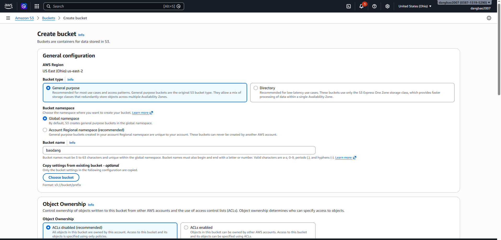
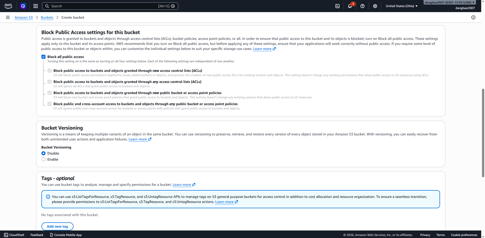
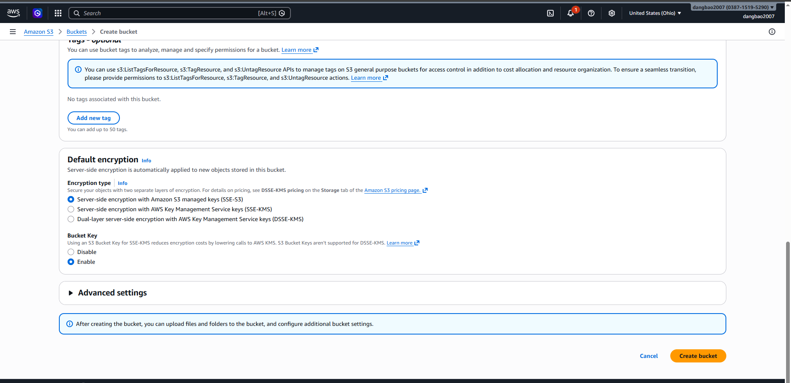
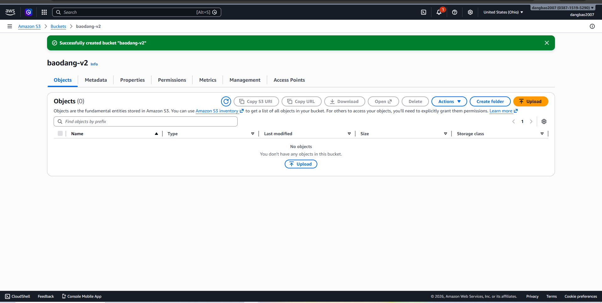

### 2. Upload Object
Upload a file to the S3 bucket.

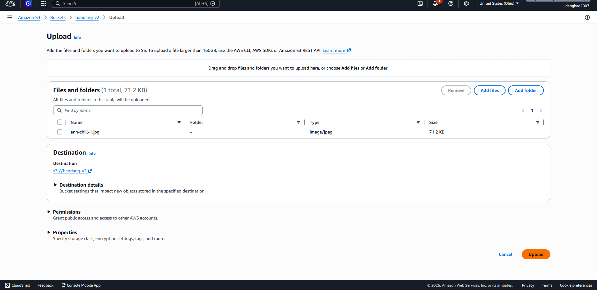
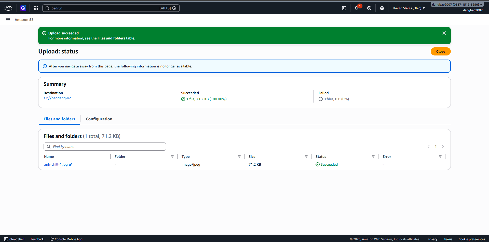

### 3. Versioning
Enable versioning to manage multiple versions of an object.

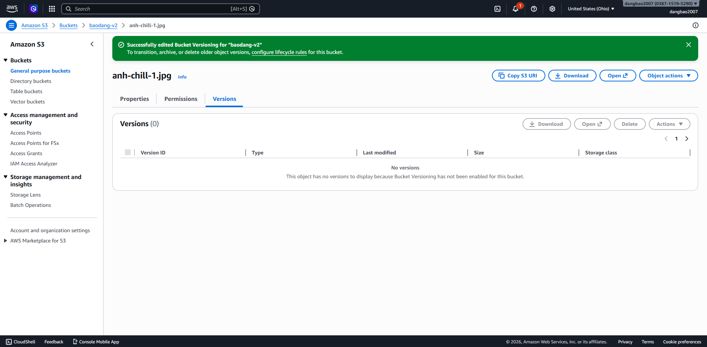
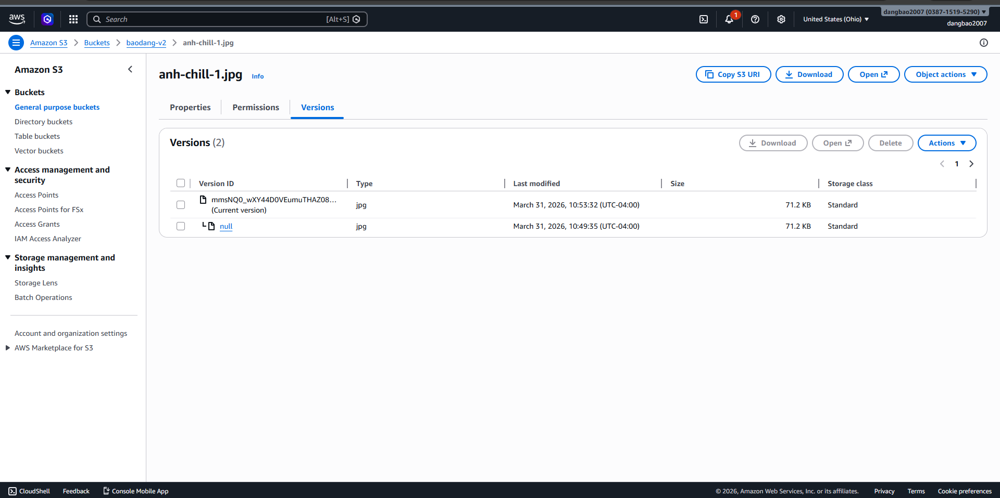

### 4. Static Website Hosting
Configure the S3 bucket to host a static website using `index.html`.

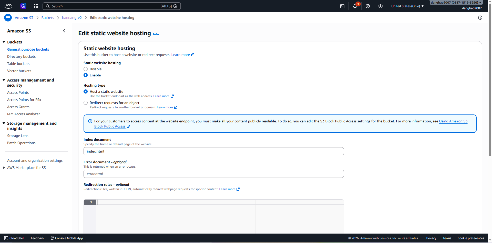
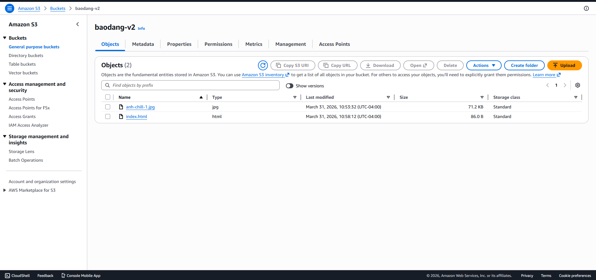
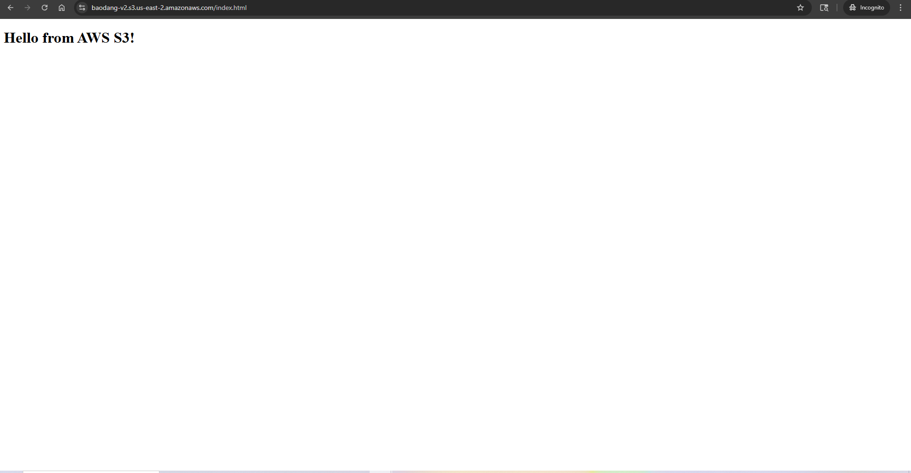

### 5. Bucket Policy
Set up a policy to control access to the bucket.

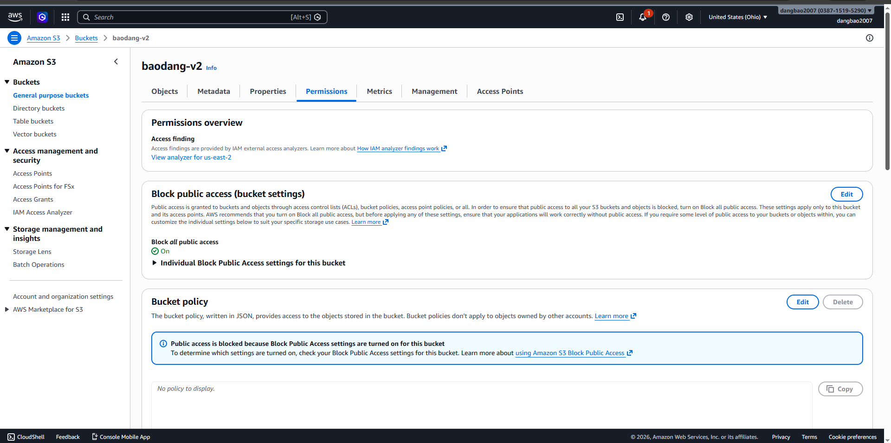
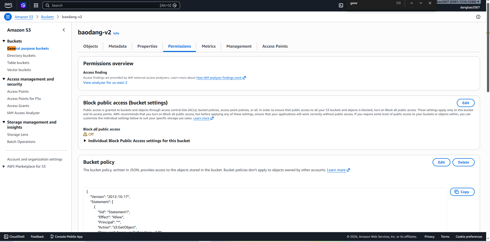
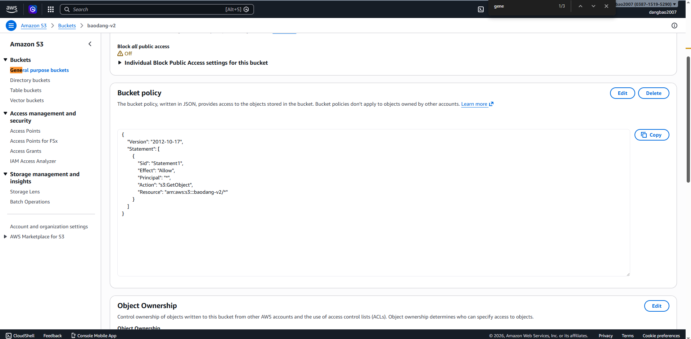

### 6. Bucket Replication
Configure Cross-Region Replication (CRR) to replicate data to another bucket.

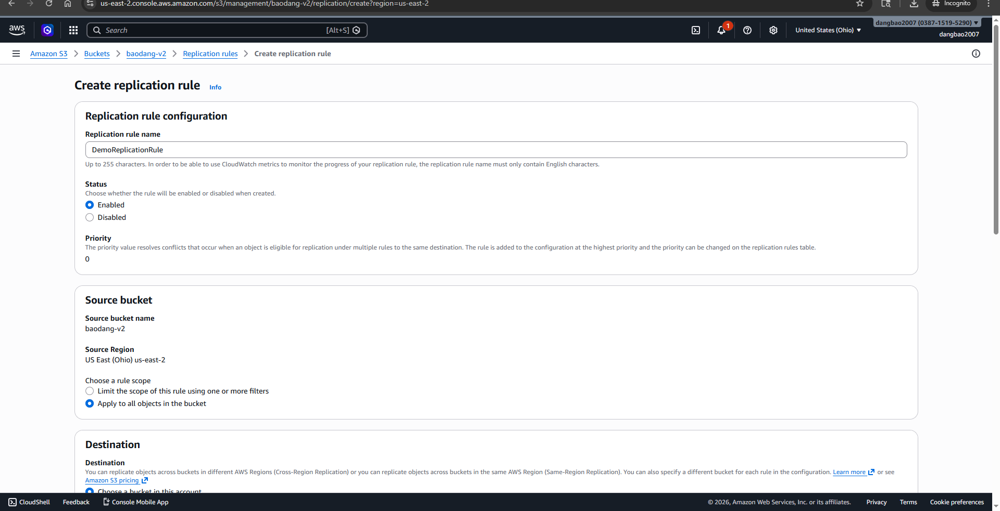
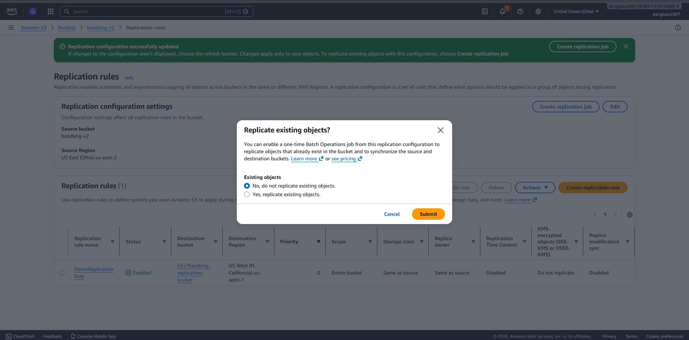
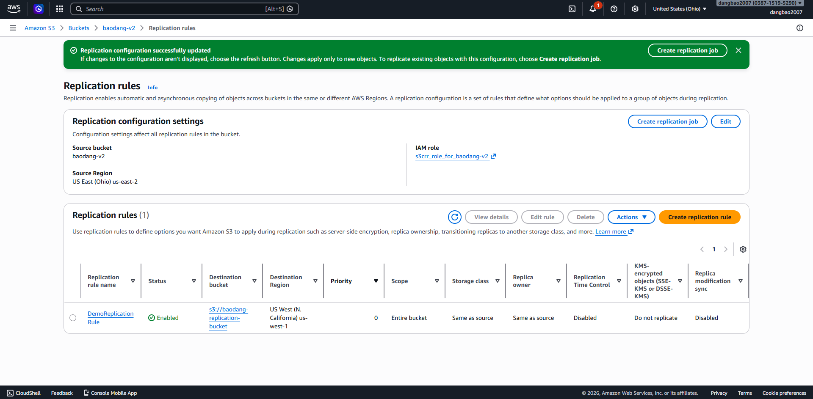
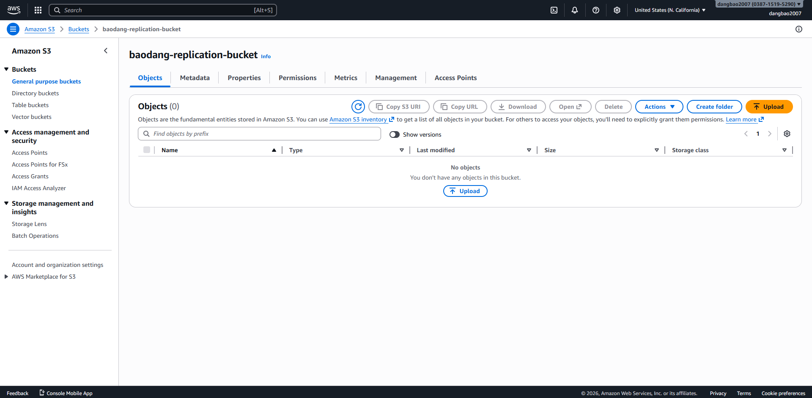
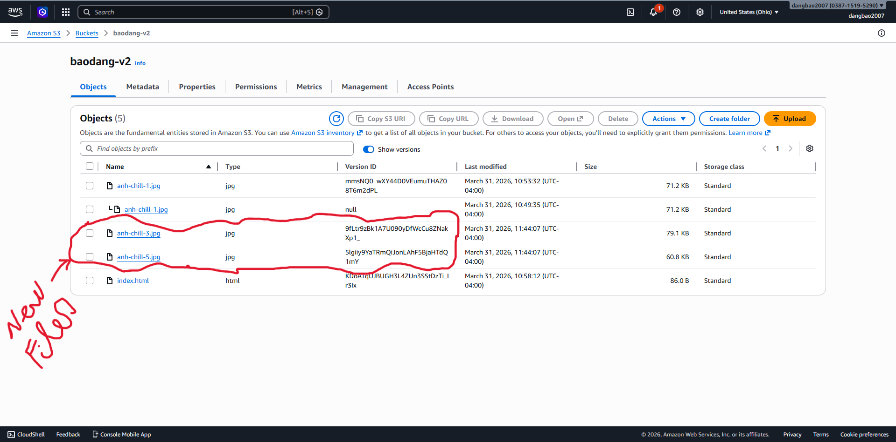
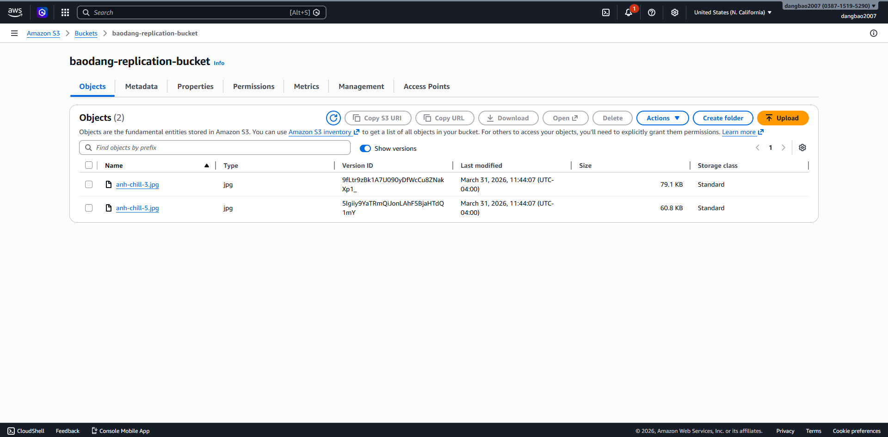

## Resources
- [AWS S3 Documentation](https://docs.aws.amazon.com/s3/)
- [S3 Pricing](https://aws.amazon.com/s3/pricing/)
