# Lab 2: AWS CloudFormation

Provision and manage AWS infrastructure using Infrastructure as Code (IaC) templates.

## What is CloudFormation?

AWS CloudFormation lets you model and provision AWS resources using declarative templates (`.yaml` or `.json`). Instead of clicking through the console, you define your infrastructure as code — making it repeatable, version-controlled, and automated.

---

## Steps

### 1. Open CloudFormation
1. Navigate to **CloudFormation** in the AWS Console.
2. Click **Create stack** > **With new resources (standard)**.

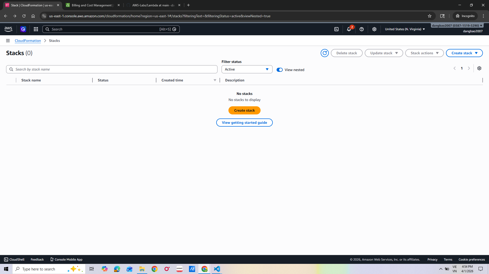
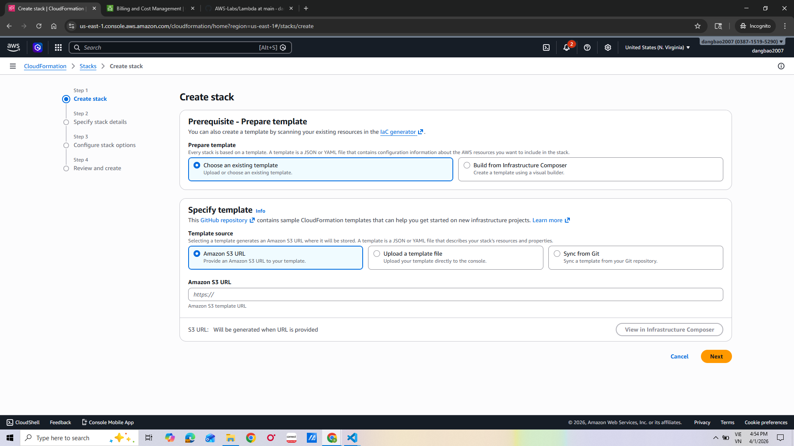

### 2. Upload Your Template
3. Under **Prerequisite**, select **Template is ready**.
4. Choose **Upload a template file** and upload your `.yaml` or `.json` template.
5. Click **View in Designer** to visualize the template resources (optional).

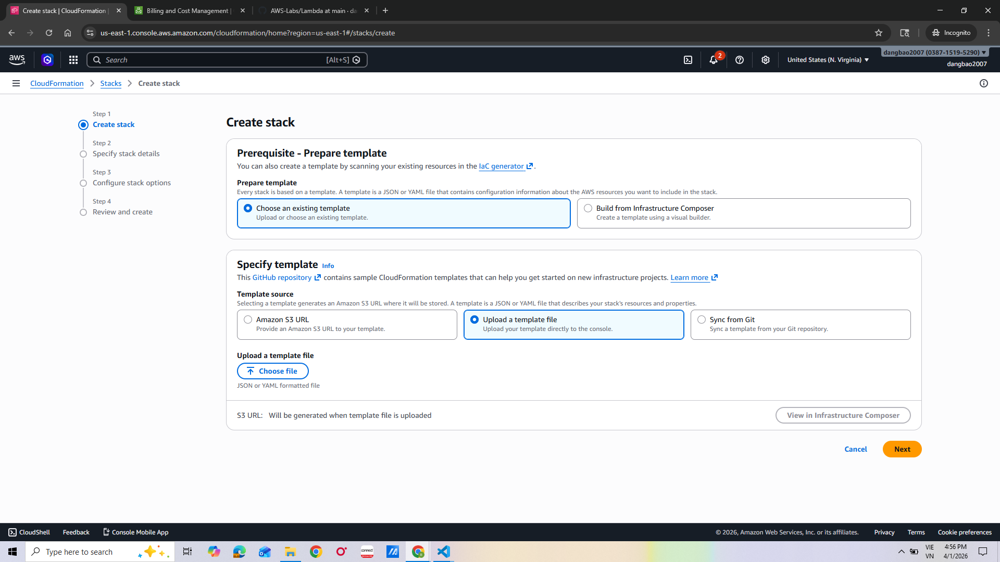
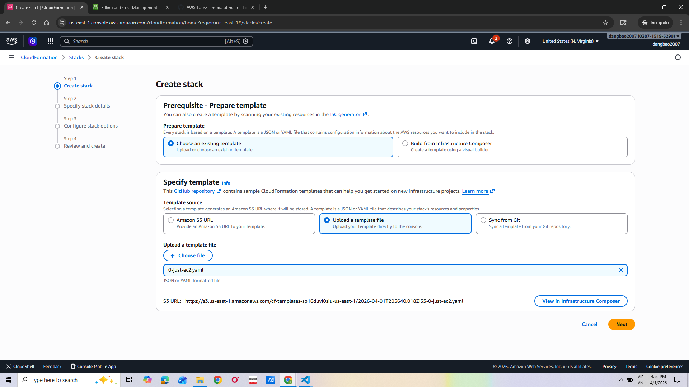
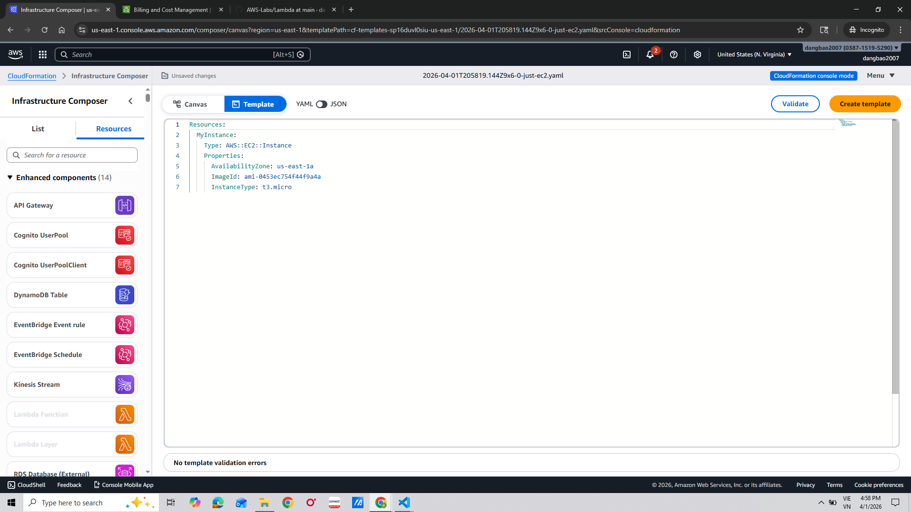

### 3. Configure Stack Details
6. Click **Next** and enter a **Stack name**.
7. Fill in any **Parameters** defined in the template (e.g., instance type, key pair).

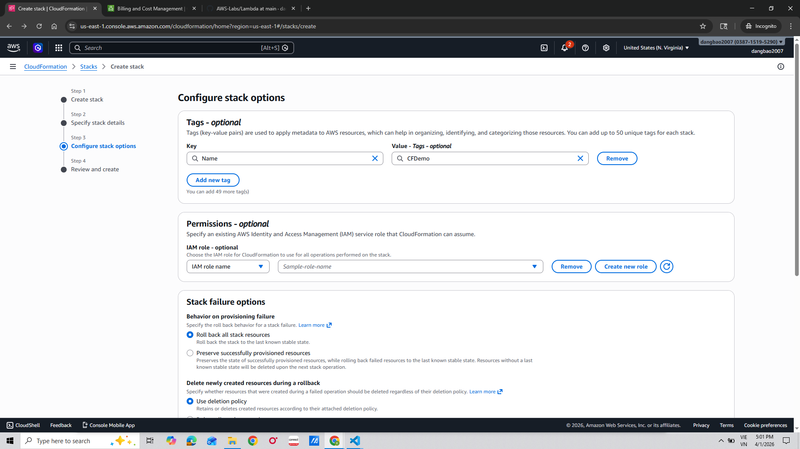
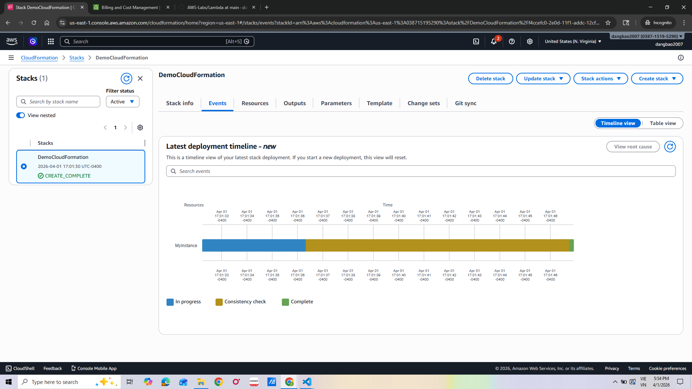

### 4. Configure Stack Options
8. Click **Next** to configure stack options (tags, IAM role, etc.).
9. Add **Tags** to identify your stack resources.
10. Under **Stack failure options**, choose **Roll back all stack resources** for safety.

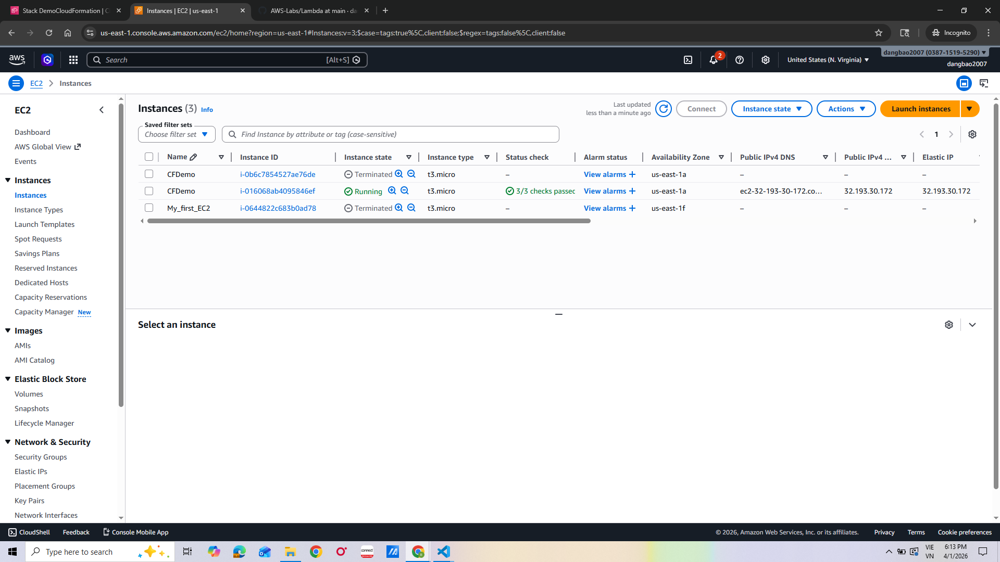
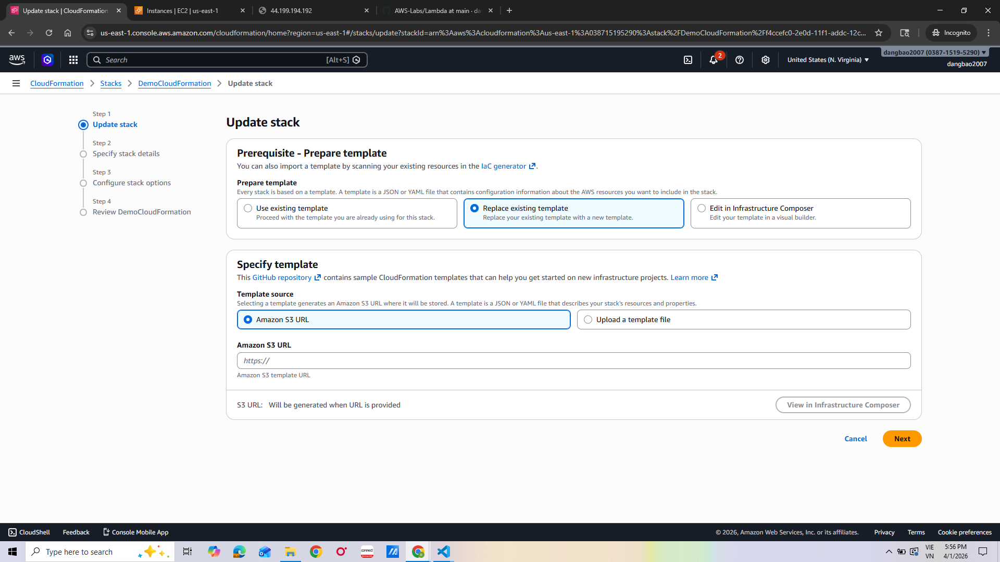

### 5. Review & Submit
11. Review the **Change set preview** and acknowledge IAM capabilities if prompted.
12. Click **Submit** to create the stack.

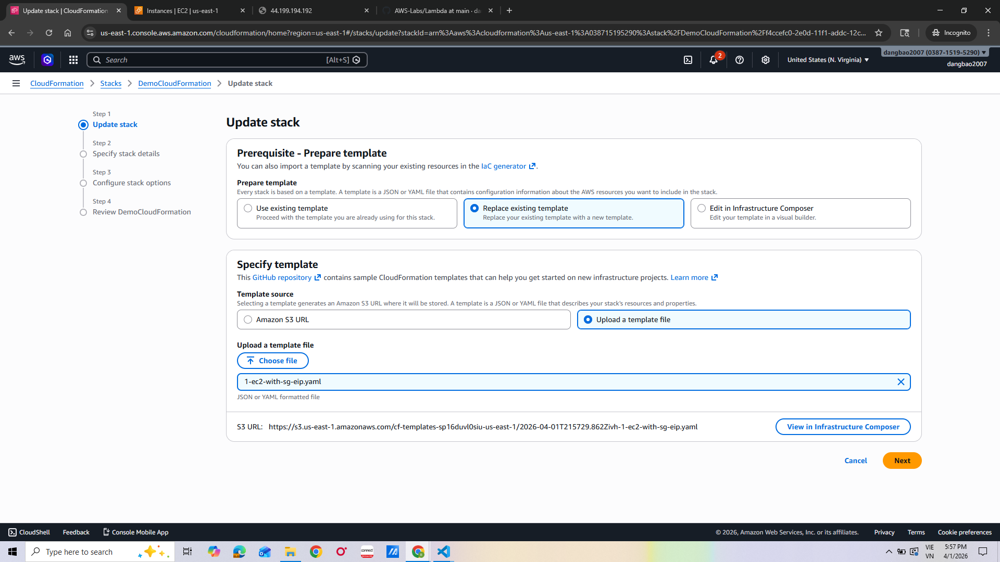
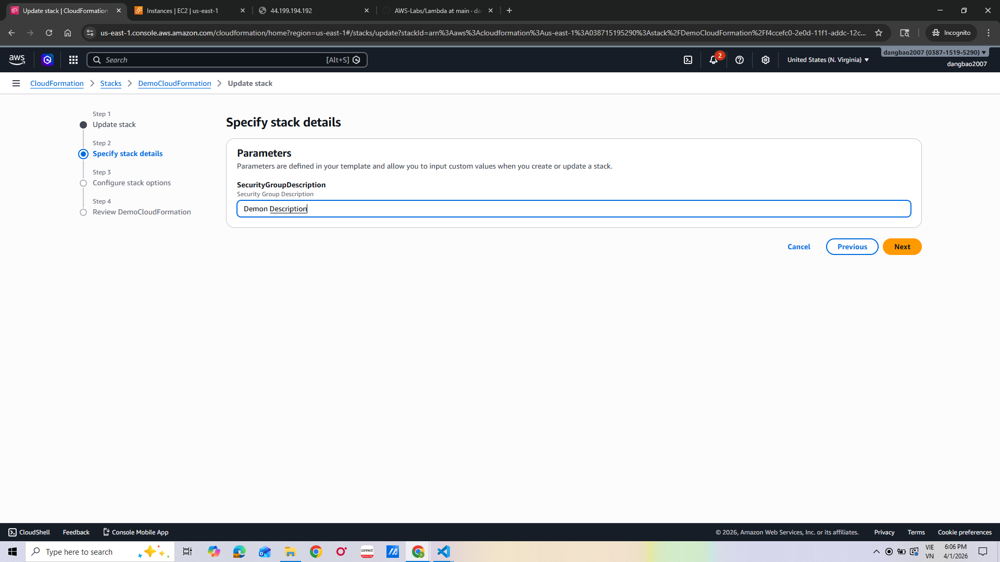

### 6. Monitor the Stack
13. Monitor the **Events** tab — wait for `CREATE_COMPLETE` status.
14. Go to the **Resources** tab to see all provisioned AWS resources.
15. Go to the **Outputs** tab to retrieve any exported values (e.g., URLs, ARNs).

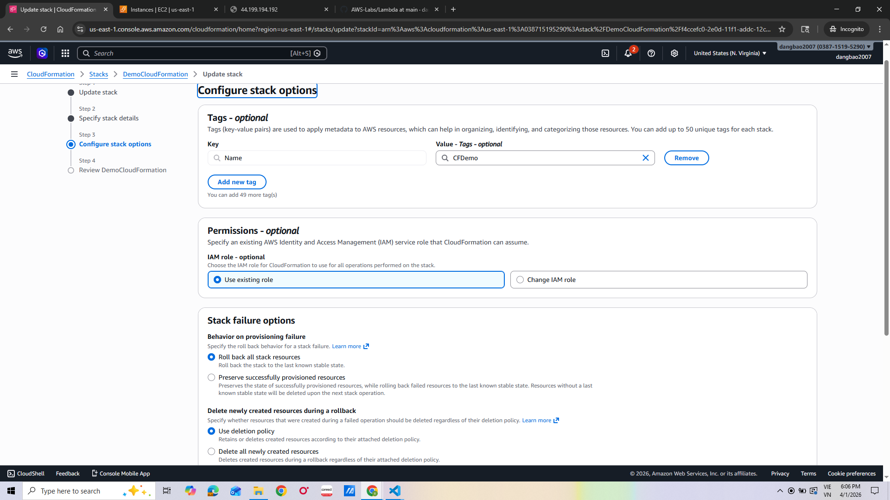
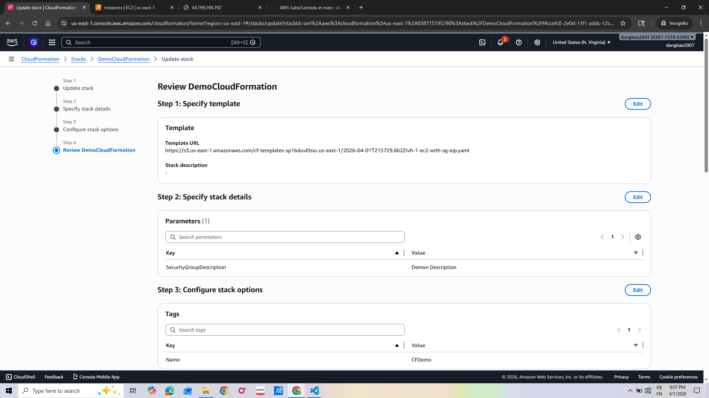
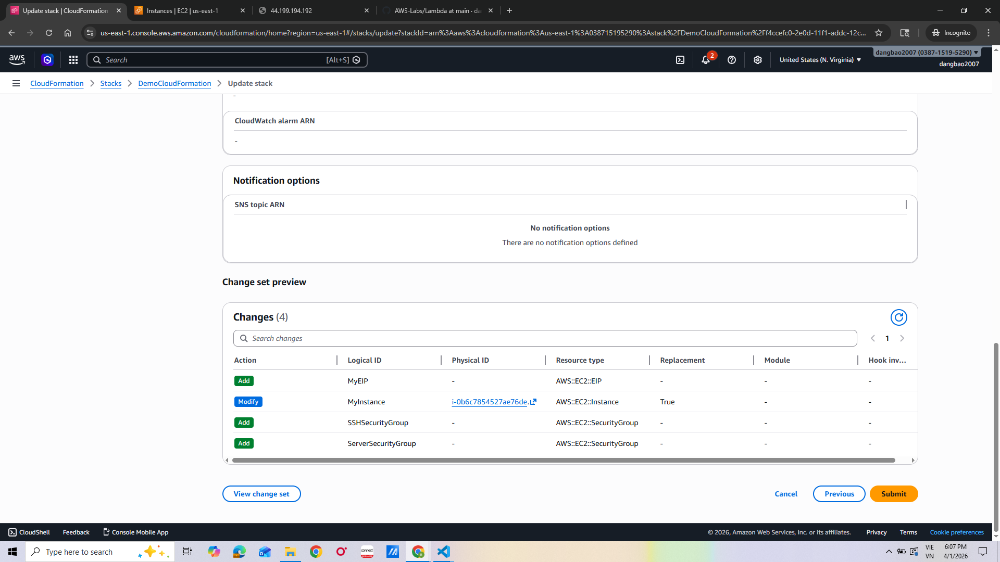
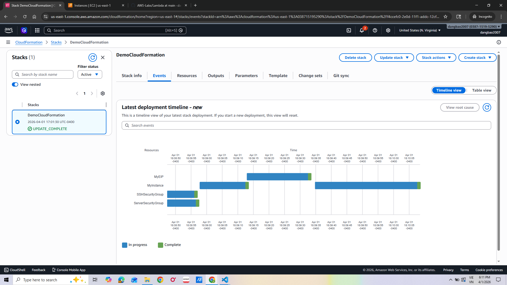

### 7. Update & Delete the Stack
16. To update, click **Update** > upload a modified template and follow the same steps.
17. When done, click **Delete** to tear down all resources cleanly.

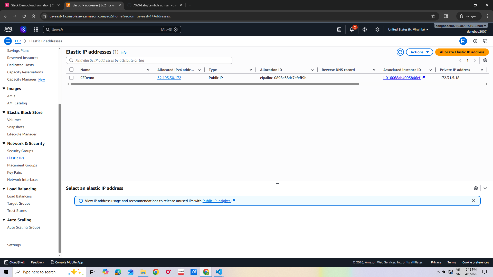
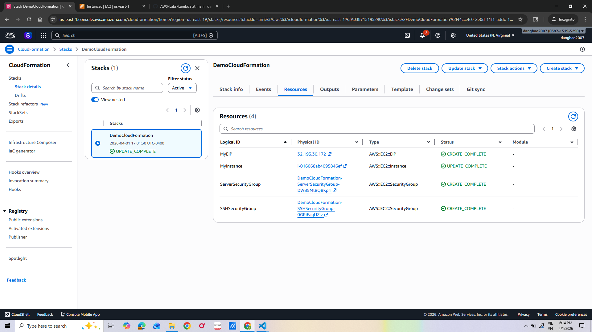

---

## Key Concepts

| Concept | Description |
|---|---|
| Stack | A collection of AWS resources managed as a single unit |
| Template | The `.yaml`/`.json` file that defines your infrastructure |
| Parameters | Input values that customize the template at deploy time |
| Outputs | Values exported from the stack (e.g., URLs, ARNs) |
| Change Set | A preview of changes before updating a stack |
| Rollback | Automatic revert if stack creation/update fails |

## Key Takeaway

CloudFormation enables true Infrastructure as Code — your entire AWS environment can be version-controlled, peer-reviewed, and redeployed consistently.
