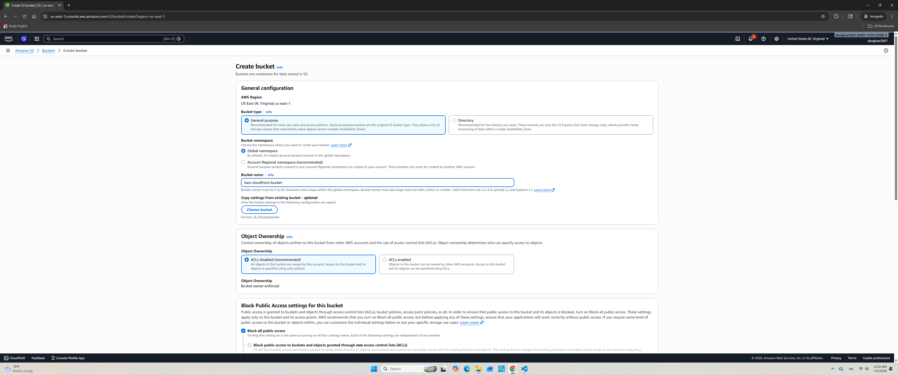
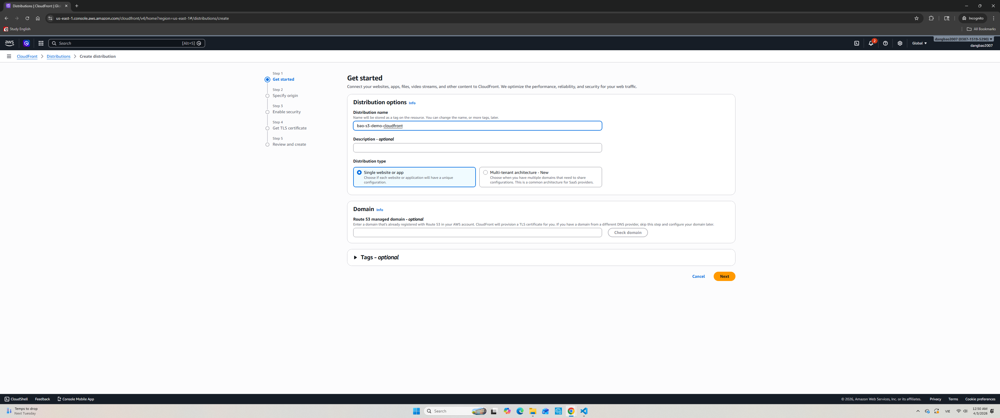
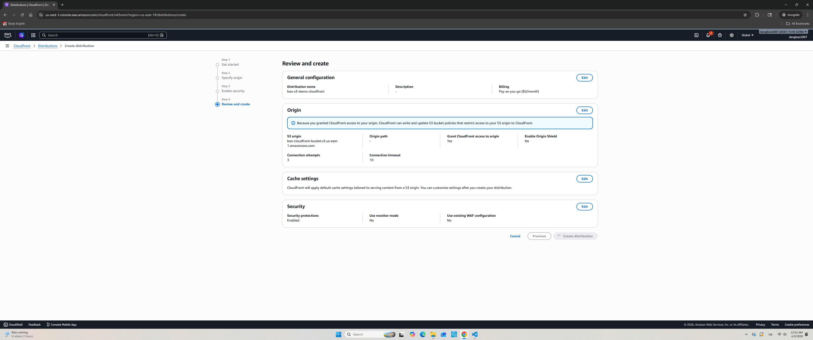
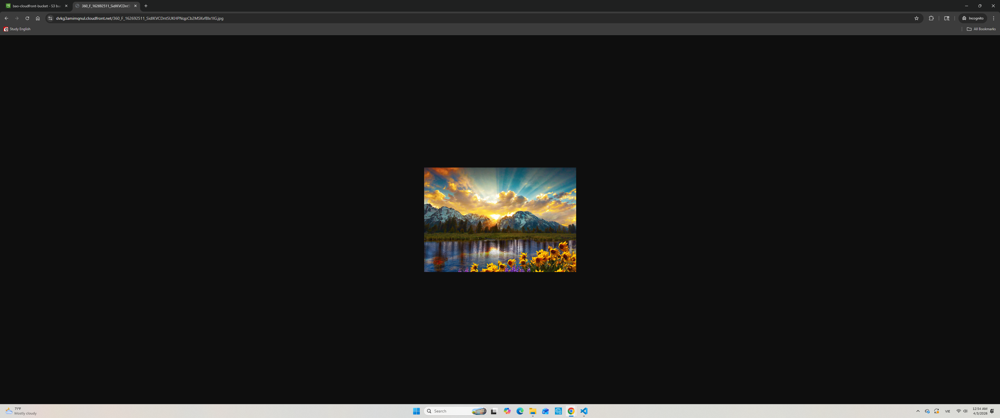

# Serve Images with Amazon S3 and CloudFront

Deliver images stored in Amazon S3 through Amazon CloudFront CDN for fast, low-latency global access.

## Architecture

```
User → CloudFront Distribution (CDN) → S3 Bucket (Origin)
```

## Services Used

- **Amazon S3** — Store and host image files
- **Amazon CloudFront** — Distribute content globally via edge locations

## Steps

### Step 1 — Create an S3 Bucket

- Go to **S3** → **Create bucket**
- Enter a unique bucket name and select a region
- Keep **Block all public access** enabled (CloudFront will handle access)



### Step 2 — Upload Images to S3

- Open the bucket → **Upload**
- Select your image files and upload them



### Step 3 — Create a CloudFront Distribution

- Go to **CloudFront** → **Create distribution**
- Set **Origin domain** to your S3 bucket
- For **Origin access**, select **Origin Access Control (OAC)** and create a new OAC
- Copy the generated **S3 bucket policy** and apply it to your S3 bucket
- Set **Default cache behavior** → Viewer protocol policy: `Redirect HTTP to HTTPS`
- Click **Create distribution** and wait for the status to become `Enabled`



### Step 4 — Access Images via CloudFront URL

- Copy the **Distribution domain name** (e.g. `xxxx.cloudfront.net`)
- Access your image: `https://xxxx.cloudfront.net/<image-filename>`



## Key Concepts

| Concept | Description |
|---|---|
| **Edge Location** | CloudFront caches content closer to users worldwide |
| **Origin Access Control (OAC)** | Restricts S3 access so only CloudFront can read objects |
| **Cache Behavior** | Rules that define how CloudFront handles requests |
| **TTL** | How long CloudFront caches content before fetching from origin |

## Benefits

- Faster image delivery via global edge locations
- S3 bucket remains private — not directly accessible from the internet
- Reduces load on S3 origin
