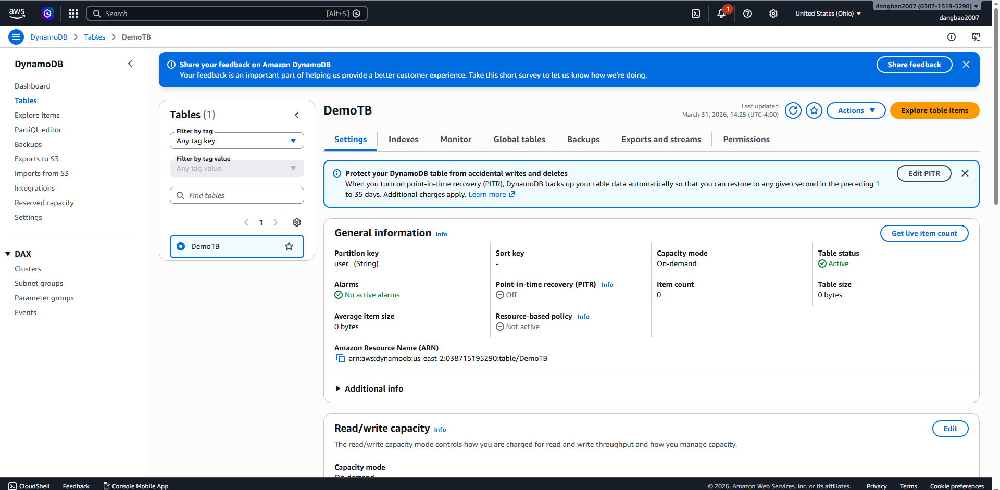
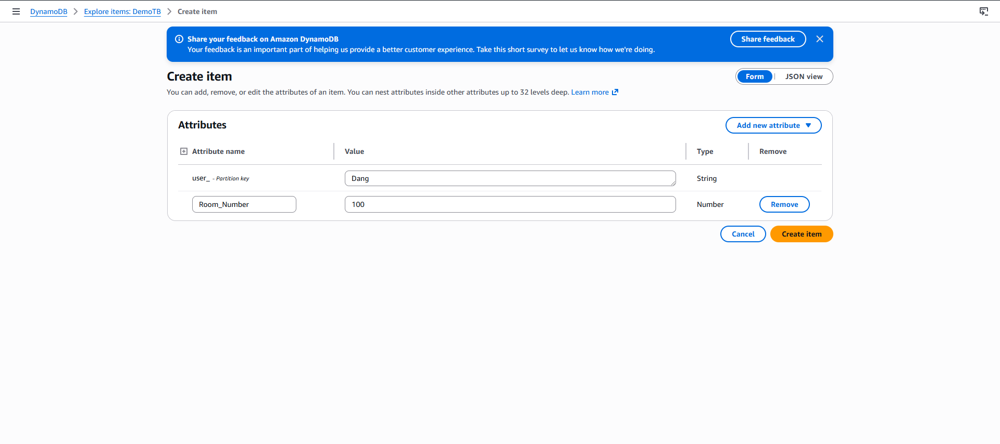
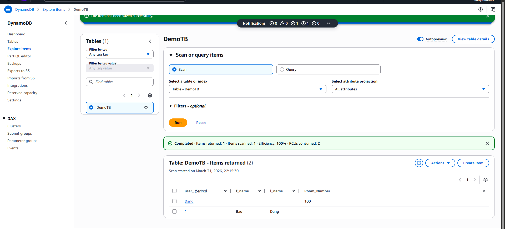

# AWS DynamoDB - Hands-on Lab

## Overview

This lab demonstrates how to work with **Amazon DynamoDB** — a fully managed, serverless NoSQL database service provided by AWS. The focus is on creating and managing items within a DynamoDB table using the AWS Management Console.

## What is Amazon DynamoDB?

Amazon DynamoDB is a key-value and document database that delivers single-digit millisecond performance at any scale. It is:

- **Serverless** — no infrastructure to manage
- **Highly available** — built-in replication across multiple Availability Zones
- **Scalable** — automatically scales throughput capacity up or down
- **Secure** — integrated with AWS IAM for fine-grained access control

## Lab Objectives

- Create a DynamoDB table
- Insert items into the table using the AWS Console
- Understand partition keys and item attributes

## Steps Performed

### 1. Create Items in DynamoDB Table

Navigate to the DynamoDB console and select the target table to begin adding items.

---

Use the **Create item** form to define attributes and values for each item.

---

Confirm the items have been successfully created and are visible in the table view.

## Key Concepts

| Concept | Description |
|---|---|
| Table | A collection of items (similar to a table in relational DB) |
| Item | A single data record (similar to a row) |
| Attribute | A data element within an item (similar to a column) |
| Partition Key | Primary key used to distribute data across partitions |
| Sort Key | Optional secondary key to sort items within a partition |

## AWS Services Used

- **Amazon DynamoDB**
- **AWS Management Console**

## References

- [Amazon DynamoDB Documentation](https://docs.aws.amazon.com/dynamodb/)
- [DynamoDB Getting Started Guide](https://docs.aws.amazon.com/amazondynamodb/latest/developerguide/GettingStartedDynamoDB.html)
