# AWS RDS Lab

Hands-on practice with Amazon RDS — creating, securing, backing up, and managing a relational database.

## Technologies Used
- Amazon RDS (MySQL / PostgreSQL)
- Amazon DynamoDB
- AWS Security Group
- RDS Snapshots
- AWS Console

---

## Steps

### 1. Create RDS Database
- Go to **RDS** in the AWS Console → click **Create database**
- **Creation method**: Standard create
- **Engine**: MySQL (or PostgreSQL)
- **Template**: Free tier
- **DB instance identifier**: e.g., `my-rds-lab`
- **Master username**: `admin`
- **Master password**: set a strong password and save it
- **Instance type**: `db.t3.micro` (Free Tier eligible)
- **Storage**: 20 GiB (default)
- **Public access**: Yes (for lab purposes — disable in production)
- Click **Create database** and wait for status to become `Available`

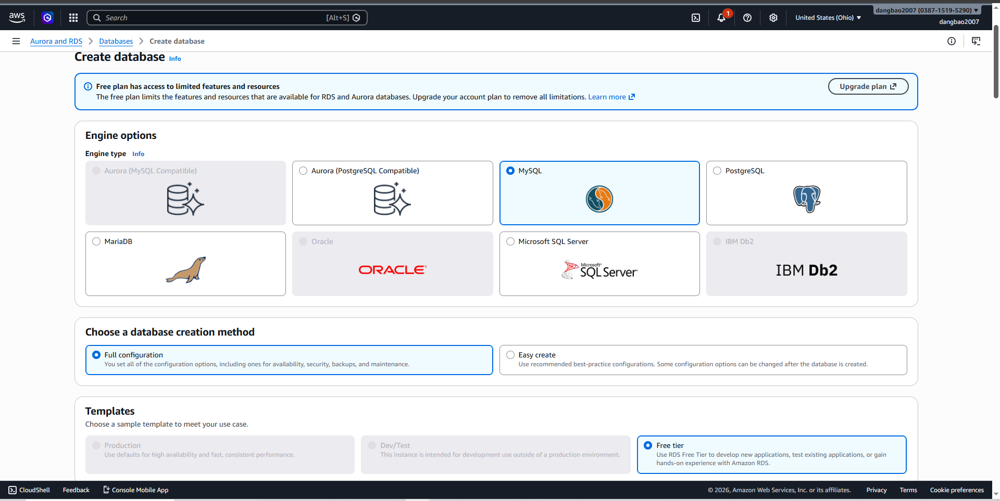
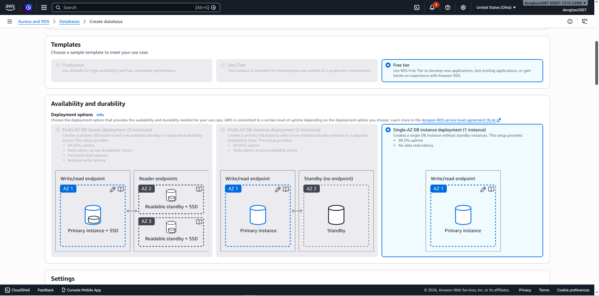
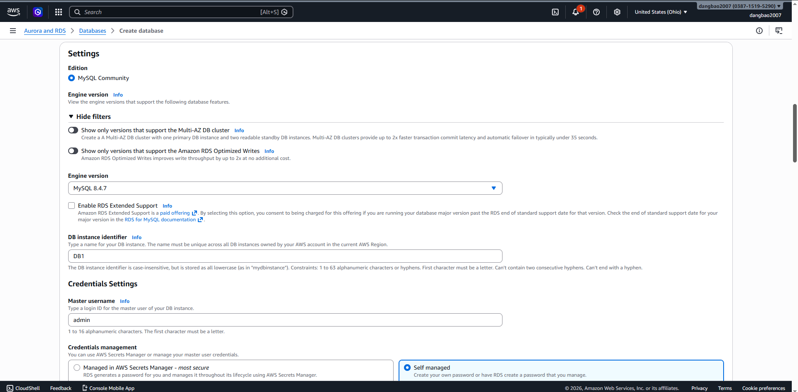
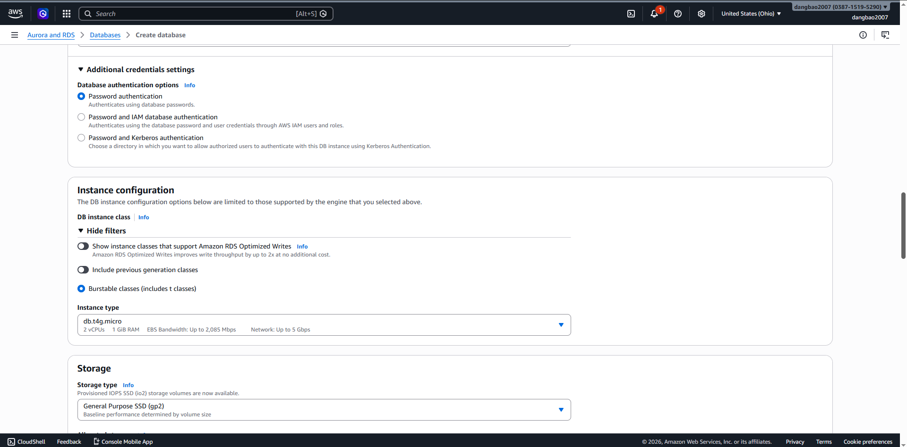
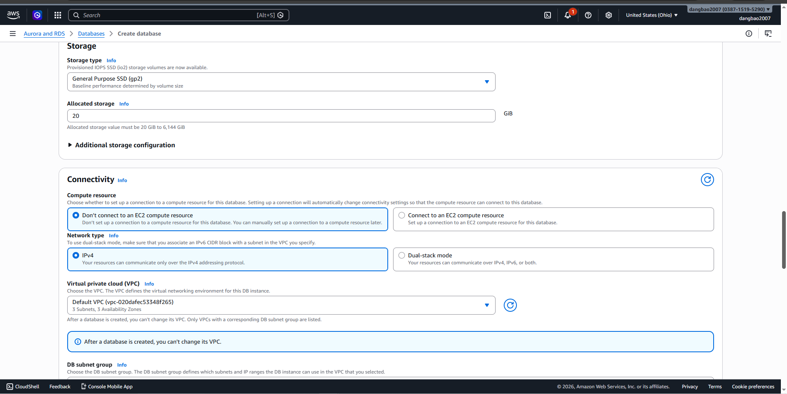
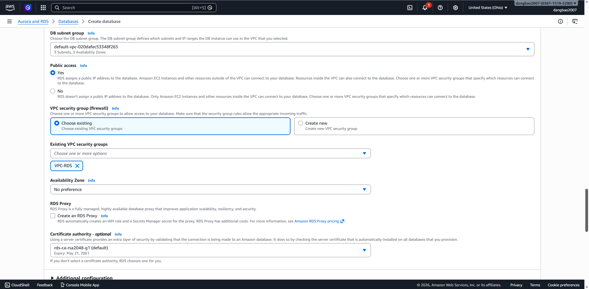
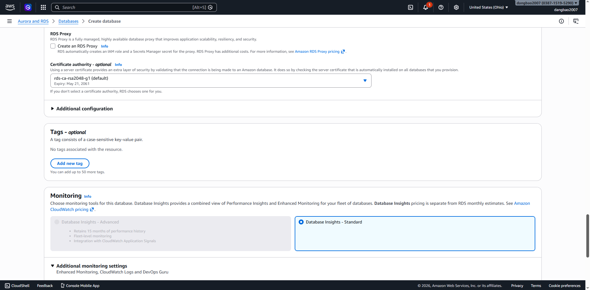
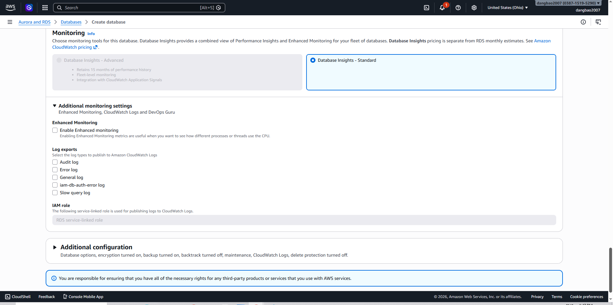

### 2. Configure Security Group
- Go to your RDS instance → **Connectivity & security** tab
- Click on the **VPC security group** link
- Select the security group → **Inbound rules** → **Edit inbound rules**
- Add a rule:
  - Type: `MySQL/Aurora` (port `3306`) or `PostgreSQL` (port `5432`)
  - Source: `My IP` (or your EC2 instance's Security Group for private access)
- Click **Save rules**

> **Best practice**: Never open database ports to `0.0.0.0/0`. Restrict to known IPs only.

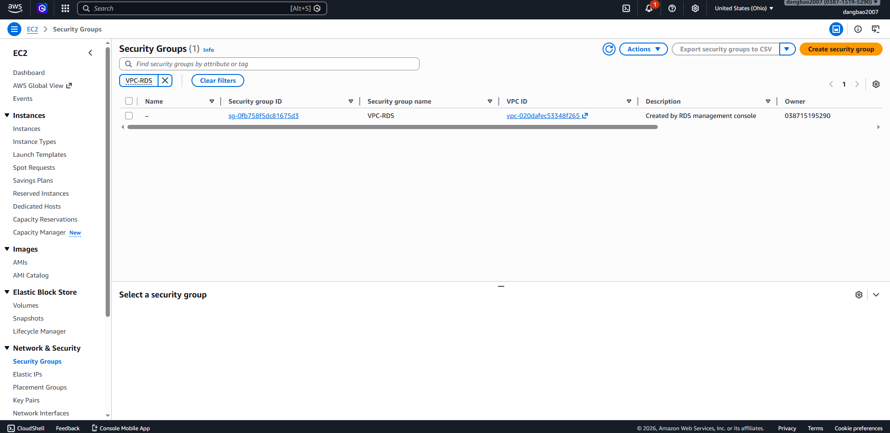

### 3. Take a DB Snapshot
- Go to your RDS instance → click **Actions** → **Take snapshot**
- Enter a **Snapshot name** (e.g., `my-rds-lab-snapshot-01`)
- Click **Take snapshot** — wait for status to become `Available`
- Snapshots can be used to restore the database to a previous state

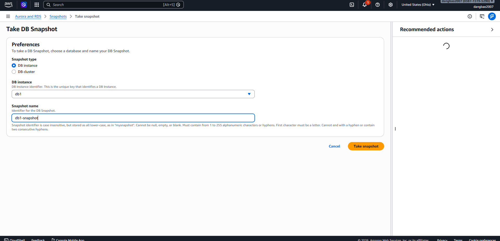

### 4. Create Items in DynamoDB
- Go to **DynamoDB** in the AWS Console → click **Tables** → select your table
- Go to the **Explore table items** tab → click **Create item**
- Switch to **JSON view** or use the **Form view** to fill in attributes:
  - Add **Partition key** value (e.g., `id`: `1`)
  - Click **Add new attribute** to add more fields (e.g., `name`, `email`)
- Click **Create item** → the item will appear in the table
- Repeat to add more items as needed
- Use **Scan** or **Query** to verify the items were created successfully

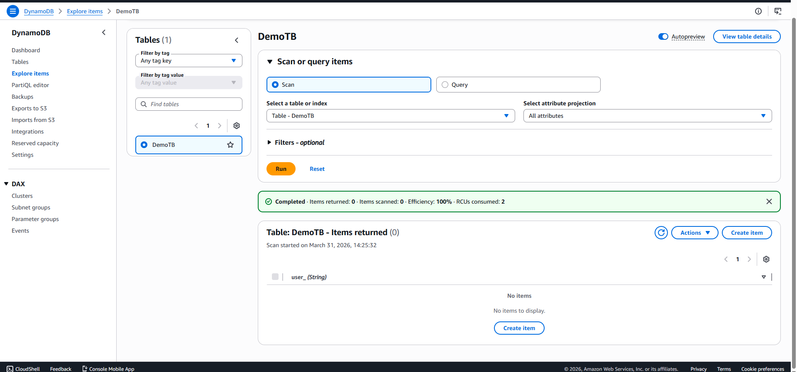
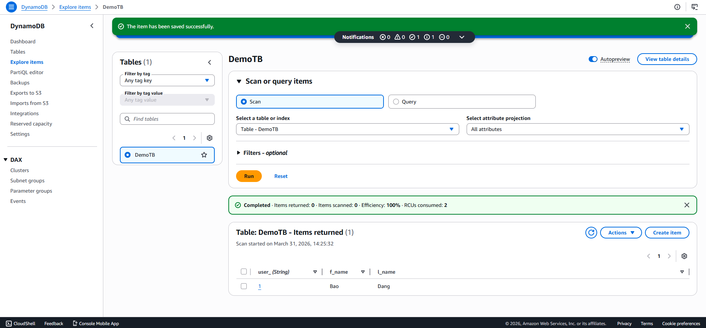

---

## Key Concepts Learned

| Concept | Description |
|---|---|
| Amazon RDS | Managed relational database — no need to manage OS or DB engine patches |
| Amazon DynamoDB | Fully managed NoSQL database — stores data as items with attributes |
| Partition Key | Unique identifier for each item in a DynamoDB table |
| Security Group | Controls which IPs/services can connect to the database |
| DB Snapshot | Manual point-in-time backup of the database |
| Endpoint | The hostname used to connect to the RDS instance |
| Free Tier | `db.t3.micro` with 20 GiB storage is free for 12 months |

---

## Resources
- [Amazon RDS Documentation](https://docs.aws.amazon.com/rds/)
- [RDS Free Tier](https://aws.amazon.com/rds/free/)
- [RDS Security Best Practices](https://docs.aws.amazon.com/AmazonRDS/latest/UserGuide/CHAP_BestPractices.Security.html)
- [RDS Snapshots](https://docs.aws.amazon.com/AmazonRDS/latest/UserGuide/USER_CreateSnapshot.html)
