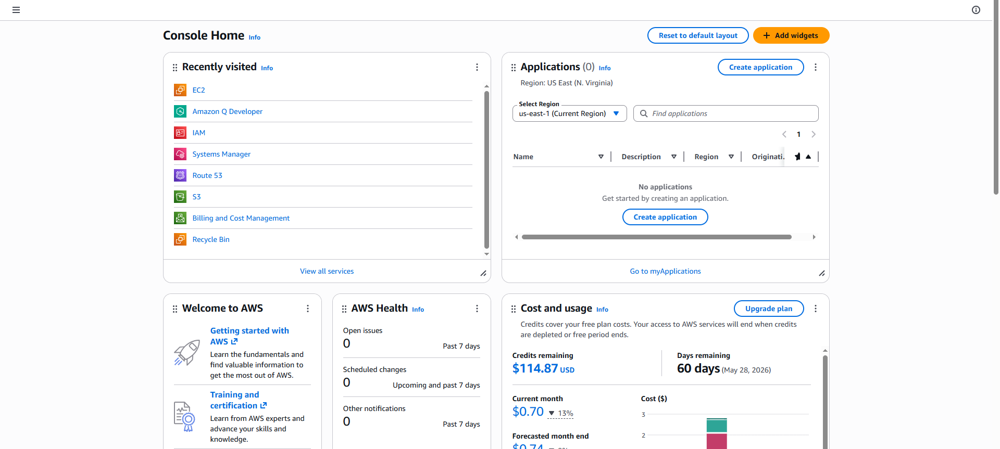
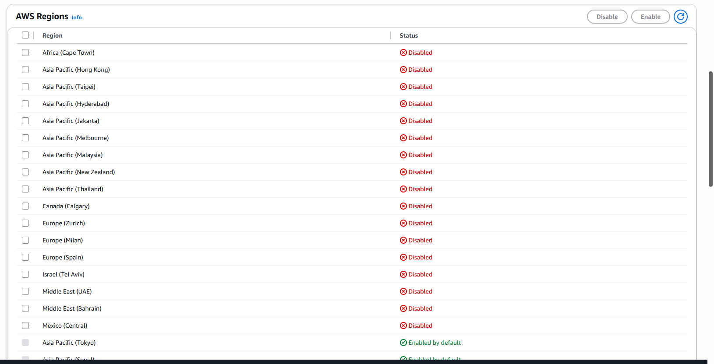
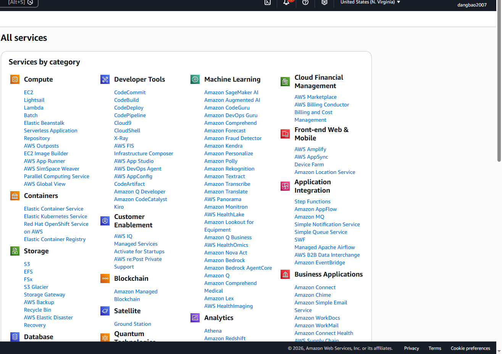
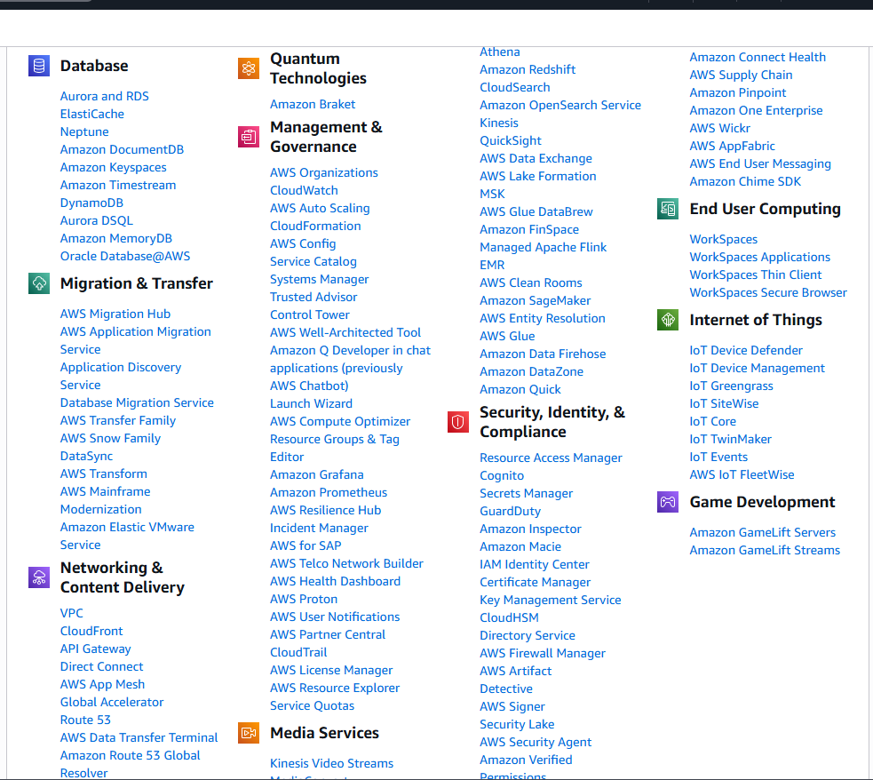
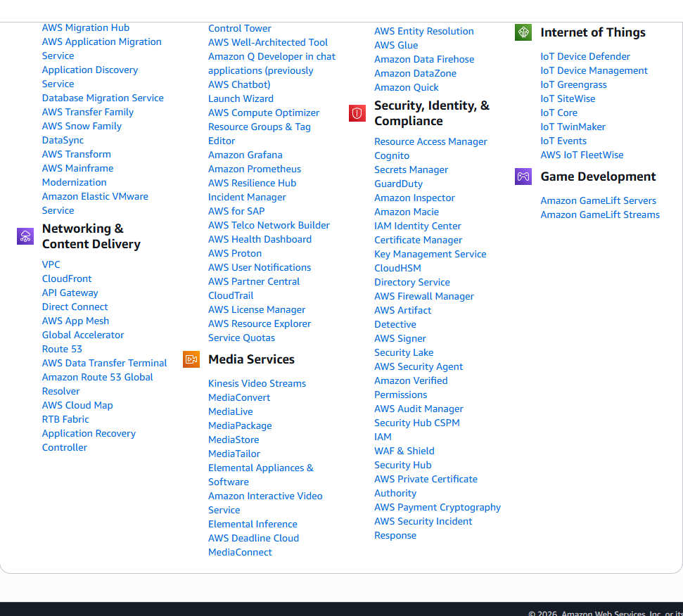
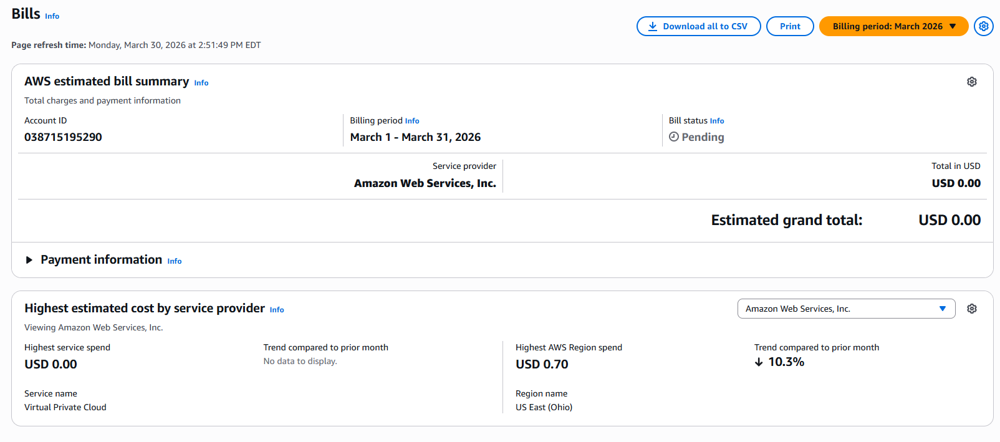
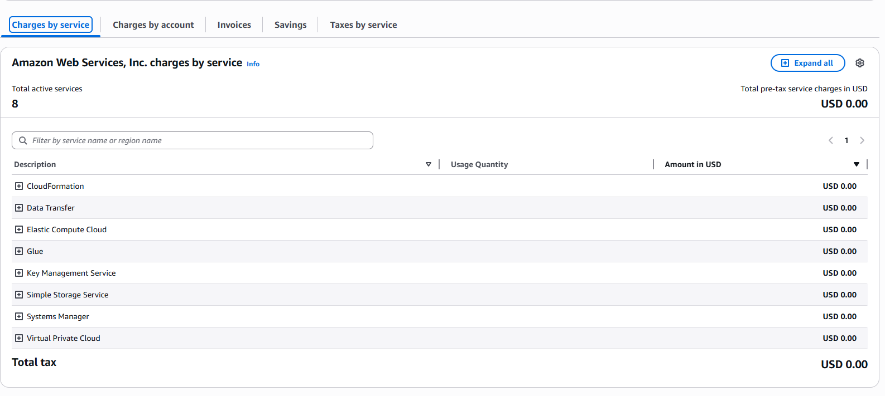

# Lab 01 - AWS Console Overview

## Objectives
- Explore the AWS Management Console
- Understand AWS Regions and Availability Zones
- Navigate AWS Services
- Monitor Free Tier usage on Billing Dashboard

## What I Learned

### AWS Console
- AWS Management Console is the web-based interface to manage AWS services
- Search bar allows quick access to any AWS service

### AWS Regions
- AWS has multiple regions around the world
- Each region is a separate geographic area
- Choose region closest to your users for low latency

### AWS Availability Zones
- Each region has multiple Availability Zones (AZs)
- AZs are isolated data centers within a region
- Multiple AZs provide high availability and fault tolerance

### Free Tier
- AWS Free Tier allows using certain services for free
- Always monitor Free Tier usage to avoid unexpected charges
- Set up billing alerts to get notified when approaching limits

## Screenshots
### AWS Console Home

### AWS Regions

### AWS Services

### Billing Dashboard

