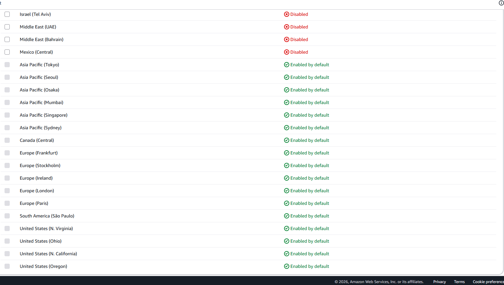

# Lab 01 - AWS Console Overview

## Objectives
- Explore the AWS Management Console
- Understand AWS Regions and Availability Zones
- Navigate AWS Services
- Monitor Free Tier usage on Billing Dashboard

## Technologies Used
- AWS Management Console
- AWS Billing Dashboard

---

## Steps

### 1. Access the AWS Management Console
- Go to [https://aws.amazon.com/console/](https://aws.amazon.com/console/)
- Sign in with your AWS account (root or IAM user)
- You will land on the **AWS Console Home** page

### 2. Explore AWS Regions
- In the top-right corner, click the **Region selector** (e.g., `us-east-1`)
- Browse the list of available AWS Regions worldwide
- Select a region closest to your location for lower latency
- Note: Some services are **global** (e.g., IAM, Route 53) and some are **regional** (e.g., EC2, S3)

### 3. Navigate AWS Services
- Use the **Search bar** at the top to find any service quickly (e.g., type "EC2", "S3")
- Click **Services** in the top menu to browse all service categories:
  - Compute, Storage, Database, Networking, Security, etc.
- Pin frequently used services to the Console Home for quick access

### 4. Monitor Free Tier & Billing Dashboard
- In the top-right, click your **account name** → **Billing and Cost Management**
- Go to **Free Tier** tab to see current usage vs. limits for each service
- Set up a **Billing Alert**:
  - Go to **Budgets** → **Create budget**
  - Choose "Zero spend budget" or set a custom threshold
  - Add your email to receive alerts before exceeding Free Tier limits

---

## Key Concepts Learned

| Concept | Description |
|---|---|
| AWS Console | Web-based UI to manage all AWS services |
| Region | Separate geographic area (e.g., `ap-southeast-1` = Singapore) |
| Availability Zone (AZ) | Isolated data centers within a region |
| Free Tier | Limited free usage for 12 months (or always free for some services) |
| Billing Alert | Notification when spending approaches a defined threshold |

---

## Resources
- [AWS Management Console](https://aws.amazon.com/console/)
- [AWS Global Infrastructure](https://aws.amazon.com/about-aws/global-infrastructure/)
- [AWS Free Tier](https://aws.amazon.com/free/)
- [AWS Billing Documentation](https://docs.aws.amazon.com/billing/)
