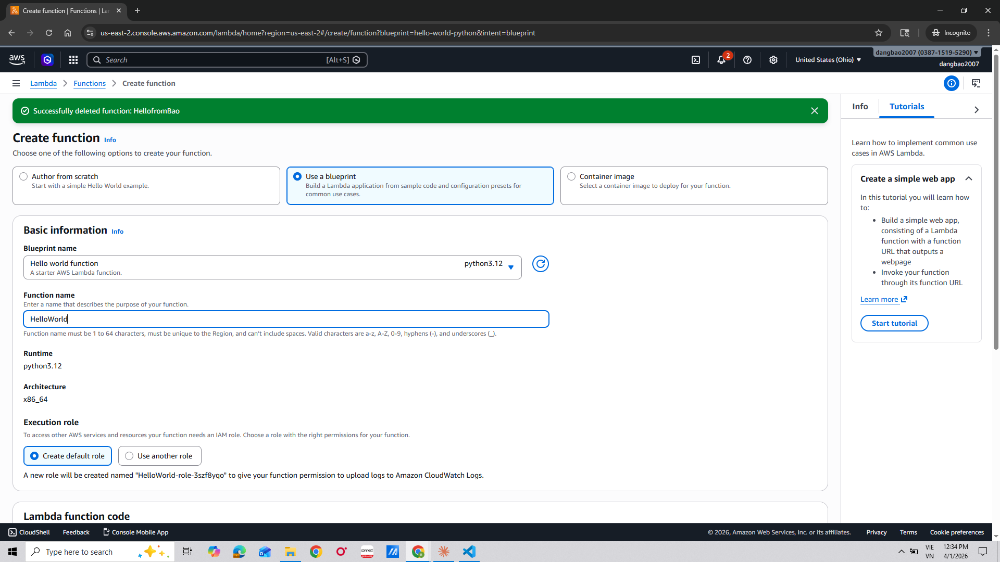
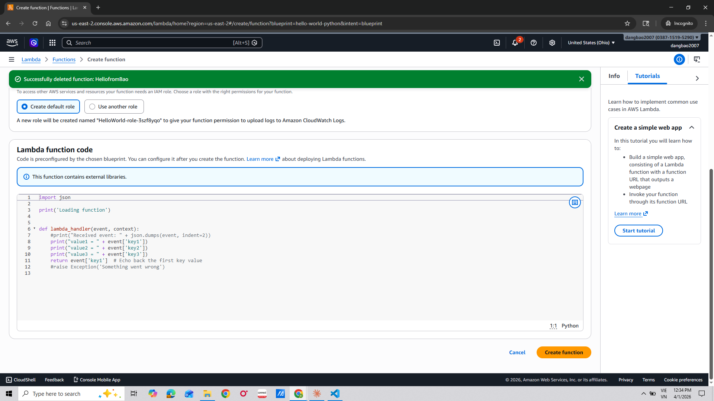
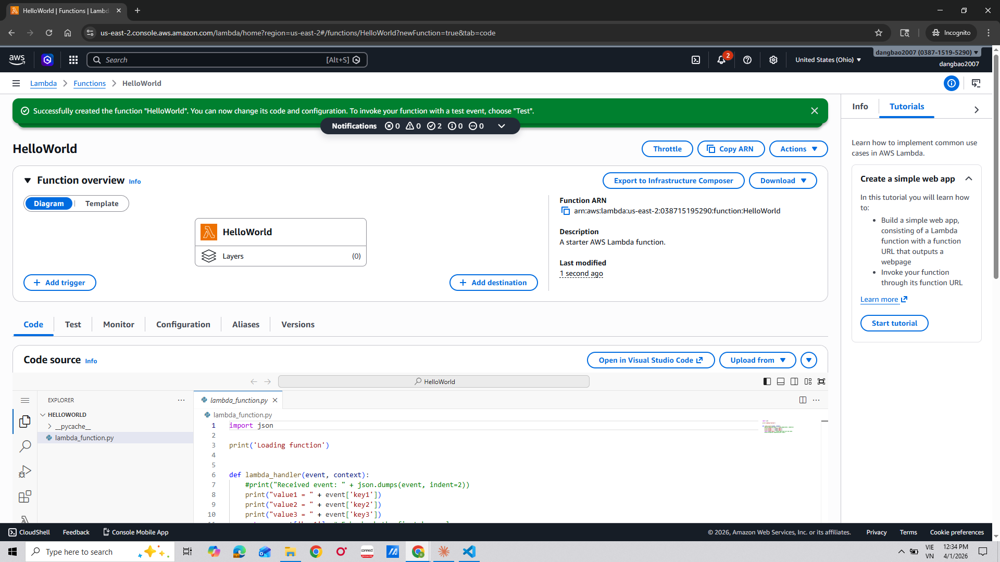
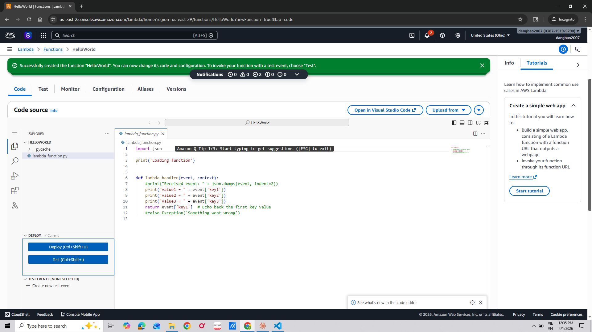
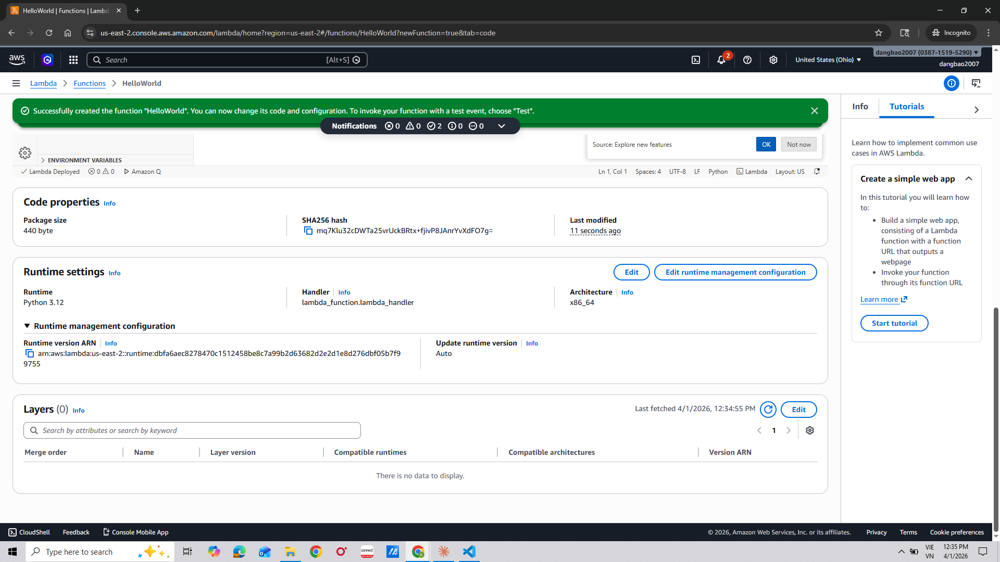
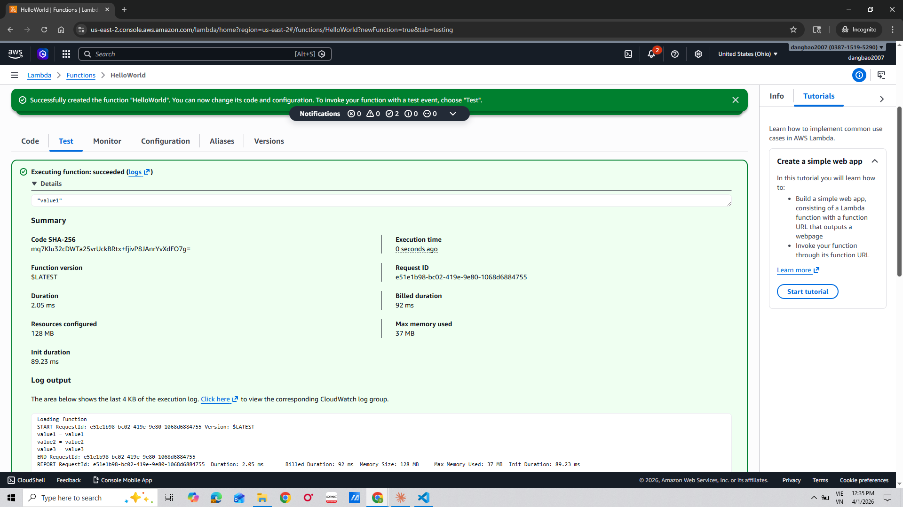
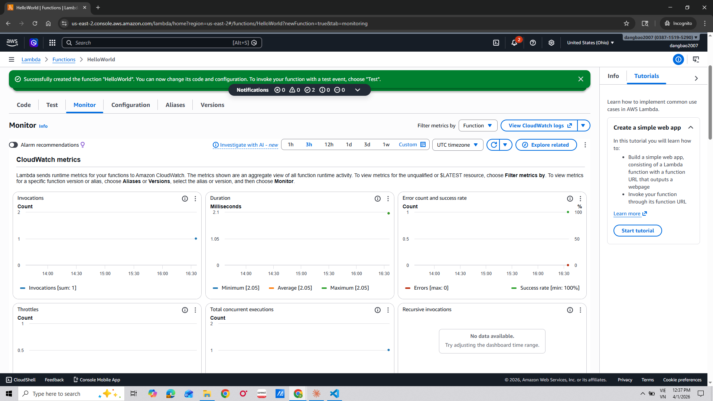
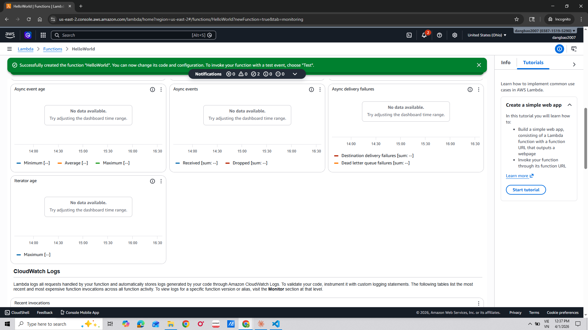
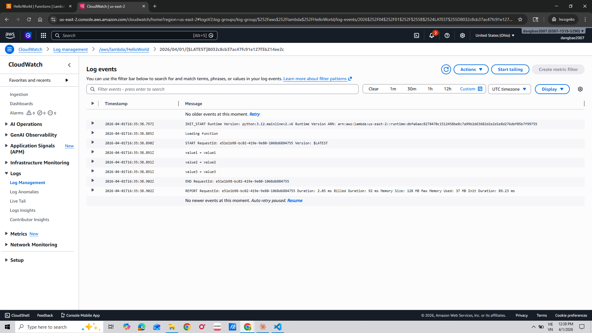
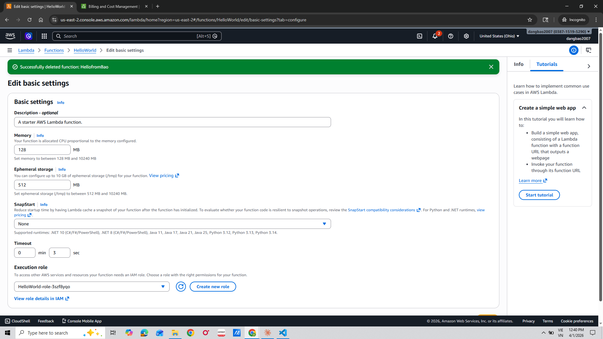

# AWS Lambda Function Lab

Step-by-step guide to creating an AWS Lambda Function.

## Steps

### Step 1 - Access Lambda Console

- Log in to AWS Console
- Search for and select **Lambda** service

### Step 2 - Create a New Function

- Click **Create function**
- Select **Author from scratch**

### Step 3 - Configure Function

- Enter a **Function name**
- Choose a **Runtime** (Python, Node.js, ...)

### Step 4 - Configure IAM Role

- Create or select an **Execution role**
- Click **Create function**

### Step 5 - Write Code

- Write your code in the **Code source** section
- Click **Deploy** to save

### Step 6 - Create Test Event

- Go to **Test** → **Create new event**
- Enter a name and configure the event

### Step 7 - Run Test

- Click **Test** to run the function
- Check the result in **Execution results**

### Step 8 - View Logs

- View logs in **CloudWatch Logs**

### Step 9 - Configure Trigger

- Add a **Trigger** to the function (API Gateway, S3, ...)

### Step 10 - Complete

- Verify and confirm the function is working

## References
- [AWS Lambda Documentation](https://docs.aws.amazon.com/lambda/)
- [AWS Lambda Pricing](https://aws.amazon.com/lambda/pricing/)
