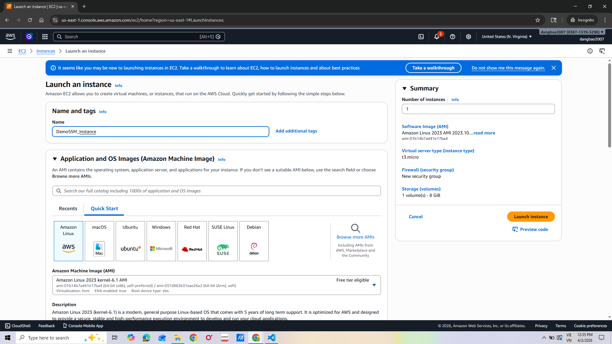
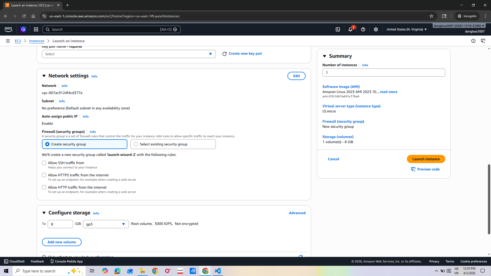
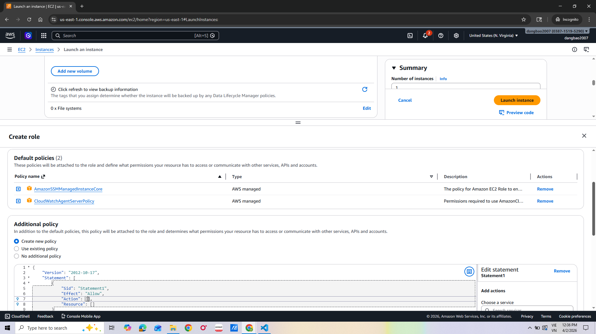
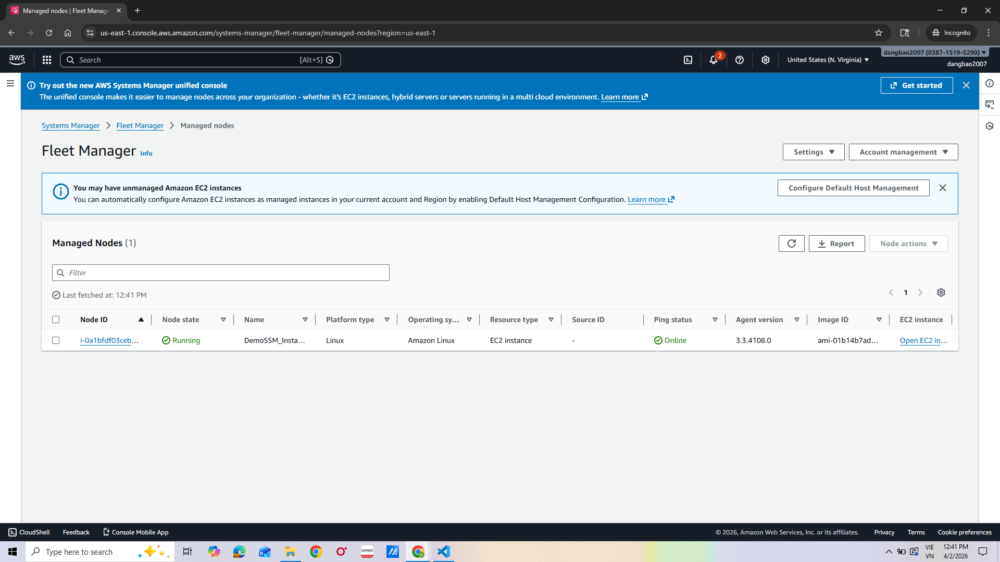
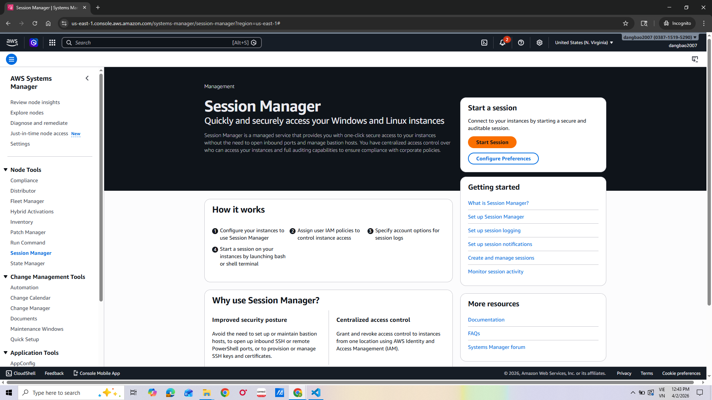
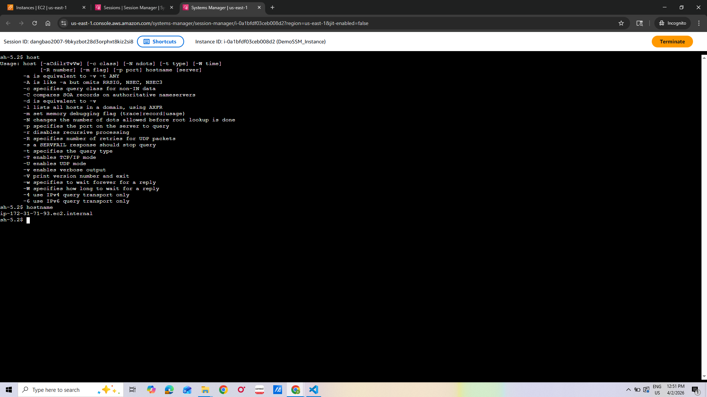

# Lab 3: AWS SSM Session Manager

Securely connect to EC2 instances without SSH keys, bastion hosts, or open inbound ports.

## What is SSM Session Manager?

AWS Systems Manager Session Manager is a fully managed service that lets you access EC2 instances through a secure browser-based shell or CLI — no SSH keys, no open port 22, no bastion host required.

---

## Steps

### 1. Prepare the EC2 Instance
1. Ensure your EC2 instance has the **SSM Agent** installed.
   - Pre-installed on **Amazon Linux 2** and **Amazon Linux 2023** by default.
   - For other OS, install manually from the [AWS docs](https://docs.aws.amazon.com/systems-manager/latest/userguide/ssm-agent.html).

### 2. Attach the Required IAM Role
2. Create or attach an IAM role to the EC2 instance with the **AmazonSSMManagedInstanceCore** managed policy.
   - Go to **IAM** > **Roles** > **Create role**
   - Select **EC2** as the trusted entity
   - Attach the `AmazonSSMManagedInstanceCore` policy
   - Attach the role to your EC2 instance under **Actions** > **Security** > **Modify IAM role**

### 3. Open Session Manager
3. Navigate to **Systems Manager** in the AWS Console.
4. In the left menu, click **Session Manager** under **Node Management**.

### 4. Start a Session
5. Click **Start session**.
6. Select your EC2 instance from the list and click **Start session**.

### 5. Use the Browser Terminal
6. A browser-based terminal opens — run commands directly on the instance without SSH.

---

## Key Concepts

| Concept | Description |
|---|---|
| SSM Agent | Software on the EC2 instance that communicates with Systems Manager |
| AmazonSSMManagedInstanceCore | IAM policy granting the instance permission to use SSM |
| Session | A secure, auditable connection to an instance |
| No open ports needed | All traffic goes through AWS — port 22 stays closed |

## Why This Matters

| Traditional SSH | SSM Session Manager |
|---|---|
| Requires open port 22 | No open inbound ports |
| Needs key pairs | No SSH keys needed |
| Requires bastion host | Direct access via AWS |
| Hard to audit | Full session logging available |

## Key Takeaway

SSM Session Manager is the modern, secure way to access EC2 instances — eliminating the attack surface of open SSH ports and unmanaged key pairs.
