# AWS EC2 Lab

## Objectives
- Launch an EC2 instance on AWS
- Connect to EC2 using EC2 Instance Connect
- Understand Security Groups and Key Pairs
- Manage IAM Users, User Groups, Roles, and MFA
- Apply Principle of Least Privilege

## Technologies Used
- AWS EC2
- Amazon Linux 2023
- AWS Security Group
- EC2 Instance Connect
- AWS IAM (Users, Groups, Roles, MFA)

---

## Steps

### 1. Launch EC2 Instance
- Go to **EC2** in the AWS Console → click **Launch instance**
- Enter a **Name** for your instance (e.g., `my-ec2-lab`)
- **AMI**: Select `Amazon Linux 2023` (Free Tier eligible)
- **Instance type**: `t3.micro` (Free Tier eligible)
- **Key pair**: Create a new key pair → RSA → `.pem` format → download and save it securely

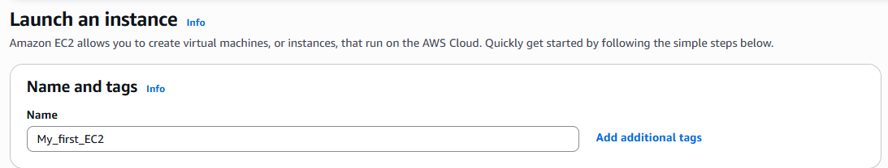
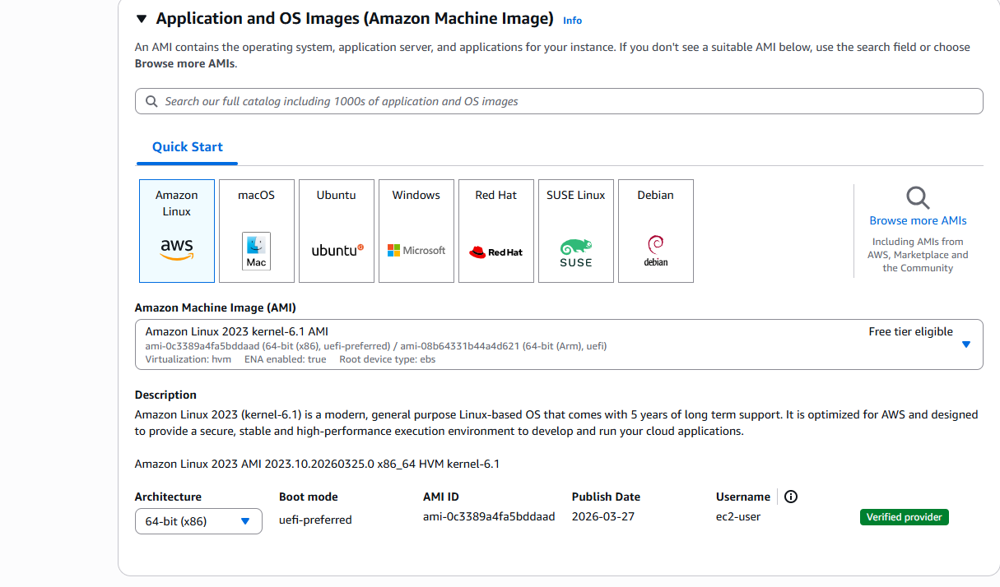
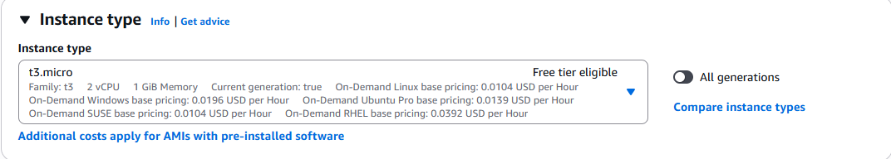
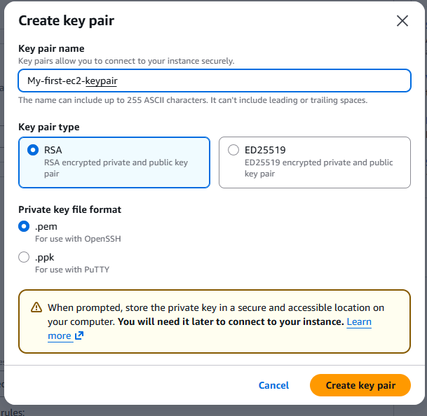

### 2. Configure Security Group
- Under **Network settings** → click **Edit**
- Create a new Security Group with a descriptive name (e.g., `ec2-lab-sg`)
- Add inbound rule:
  - Type: `SSH` | Port: `22` | Source: `0.0.0.0/0` (or your IP for better security)
- Click **Launch instance**

> **Principle of Least Privilege**: Only open ports that are strictly necessary.

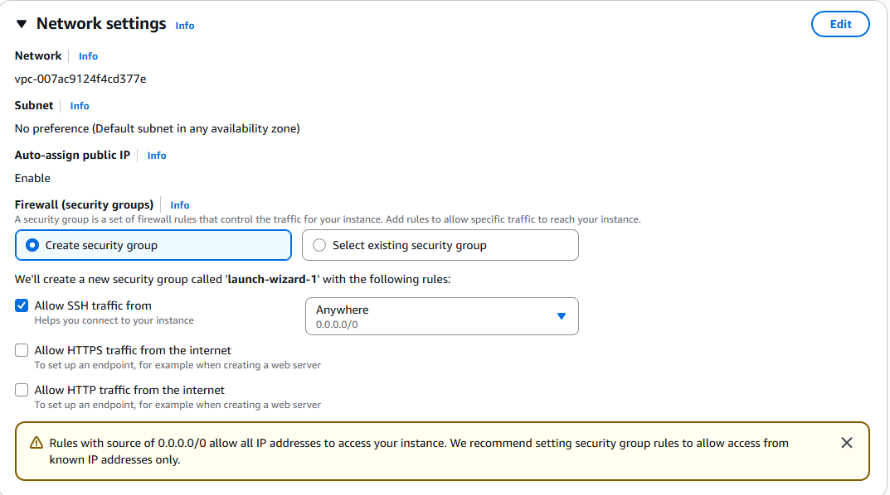
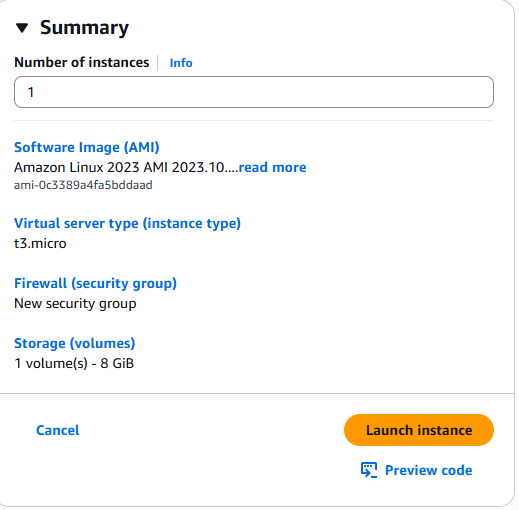

### 3. Connect to EC2 via EC2 Instance Connect
- Wait for the instance **State** to show `Running`
- Select the instance → click **Connect**
- Choose **EC2 Instance Connect** tab → click **Connect**
- A browser-based terminal opens — no key pair needed!
- Run a test command: `whoami` or `uname -r`

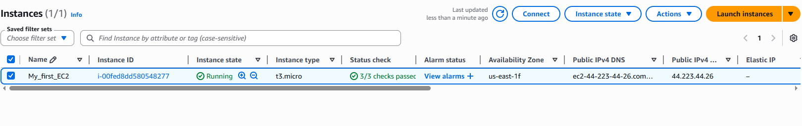

### 4. Create IAM User Groups
- Go to **IAM** → **User groups** → **Create group**
- Enter a group name (e.g., `Developers`)
- Attach a permission policy (e.g., `AmazonEC2ReadOnlyAccess`)
- Click **Create user group**

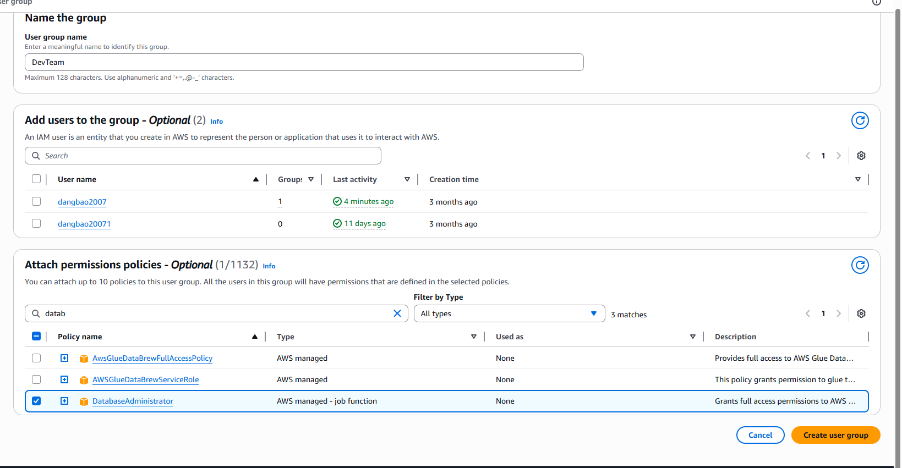
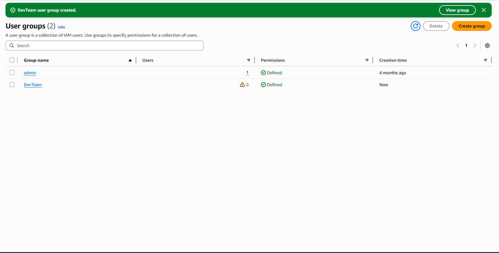

### 5. Create IAM Users
- Go to **IAM** → **Users** → **Create user**
- Enter a **username** (e.g., `dev-user-01`)
- Select **Provide user access to the AWS Management Console**
- Choose **Add user to group** → select the group created above
- Click **Create user** → download or copy the sign-in credentials

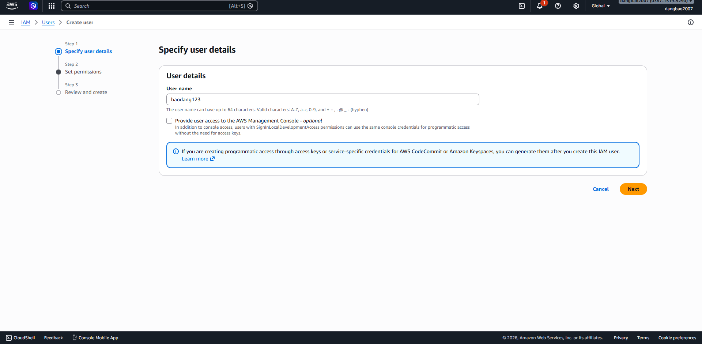
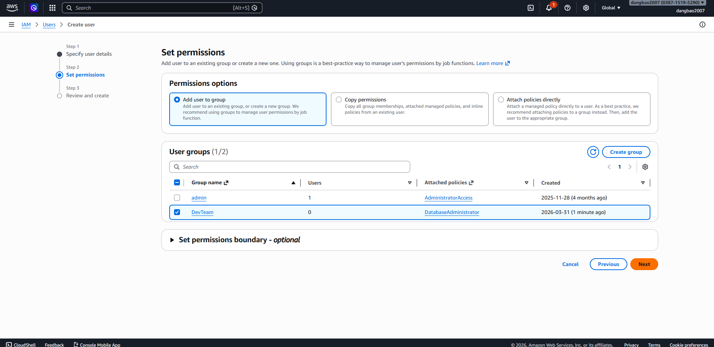
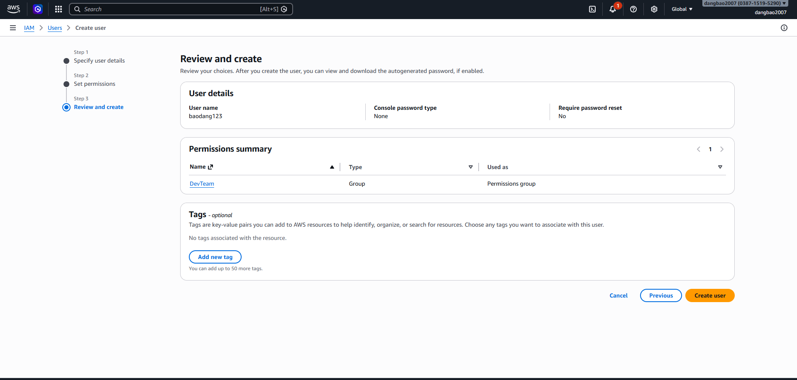

### 6. Enable MFA for IAM User
- Go to **IAM** → **Users** → select a user
- Go to **Security credentials** tab → **Multi-factor authentication (MFA)** → **Assign MFA device**
- Choose **Authenticator app** → scan the QR code with an app (e.g., Google Authenticator)
- Enter two consecutive OTP codes to verify → click **Add MFA**

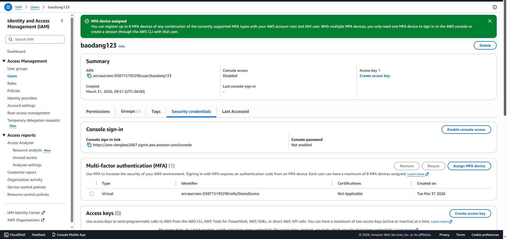

### 7. Create and Attach IAM Role to EC2
- Go to **IAM** → **Roles** → **Create role**
- **Trusted entity**: `AWS service` → `EC2`
- Attach a policy (e.g., `AmazonS3ReadOnlyAccess`)
- Name the role (e.g., `ec2-s3-read-role`) → click **Create role**
- Go back to **EC2** → select your instance → **Actions** → **Security** → **Modify IAM role**
- Select the role you just created → click **Update IAM role**

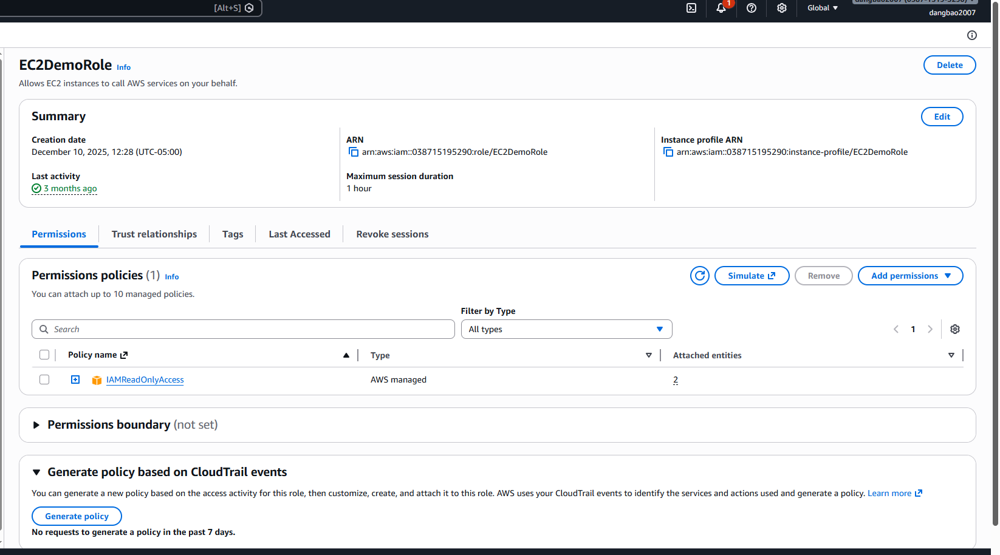
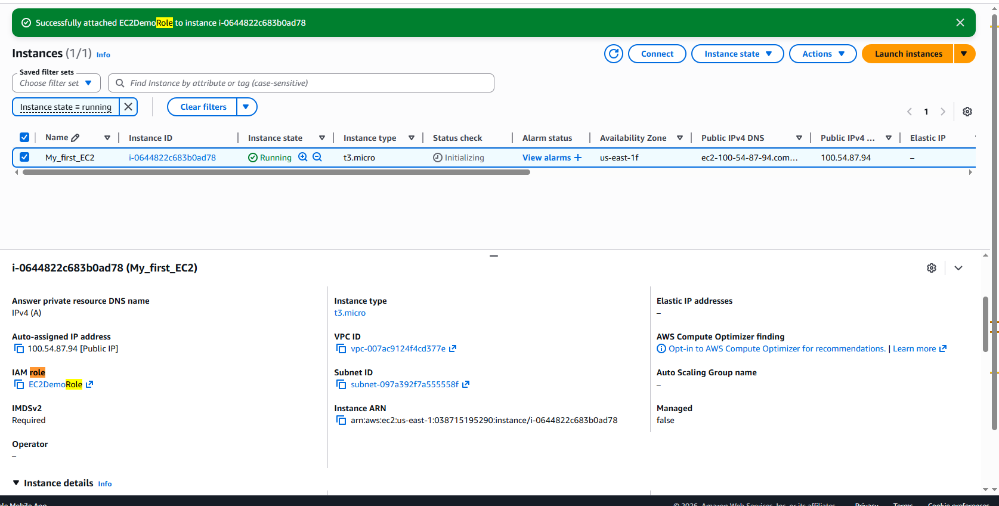

---

## Key Concepts Learned

| Concept | Description |
|---|---|
| EC2 | IaaS — virtual server in the cloud |
| Security Group | Virtual firewall controlling inbound/outbound traffic |
| Public IP vs Private IP | Public IP is internet-facing; Private IP is internal to VPC |
| EC2 Instance Connect | Browser-based SSH, no key pair required |
| IAM User Group | Assign permissions to multiple users at once |
| MFA | Extra layer of security for AWS account login |
| IAM Role | Grant AWS services permissions without using access keys |
| Least Privilege | Only grant the minimum permissions necessary |

---

## Resources
- [AWS EC2 Documentation](https://docs.aws.amazon.com/ec2/)
- [EC2 Instance Connect](https://docs.aws.amazon.com/AWSEC2/latest/UserGuide/Connect-using-EC2-Instance-Connect.html)
- [IAM Best Practices](https://docs.aws.amazon.com/IAM/latest/UserGuide/best-practices.html)
- [AWS MFA Setup](https://docs.aws.amazon.com/IAM/latest/UserGuide/id_credentials_mfa.html)
