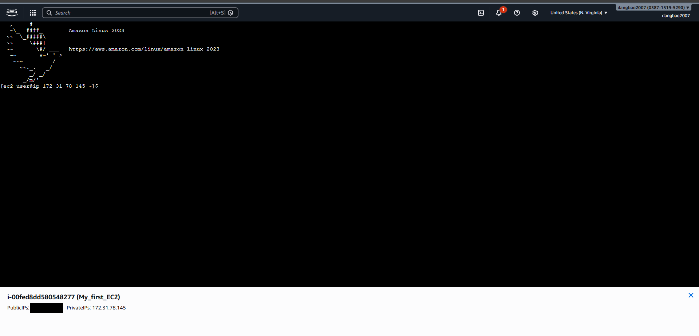

# 🖥️ AWS EC2 Lab

## 📌 Objectives
- Launch an EC2 instance on AWS
- Connect to EC2 using EC2 Instance Connect
- Understand Security Groups and Key Pairs
- Apply Principle of Least Privilege

## 🛠️ Technologies Used
- AWS EC2
- Amazon Linux 2023
- AWS Security Group
- EC2 Instance Connect

## 🚀 Steps

### 1. Launch EC2 Instance
- AMI: Amazon Linux 2023 (Free Tier eligible)
- Instance type: t3.micro (Free Tier eligible)
- Key pair: RSA, .pem format

### 2. Configure Security Group
- Allow SSH (Port 22) from anywhere
- Principle of Least Privilege: only open necessary ports

### 3. Connect to EC2
- Used EC2 Instance Connect via AWS Console
- No key pair required, connect directly from browser

### 4. IAM Users, User Groups, IAM Roles, MFA enable for Users
-Create users.
-Add users to User gorup.
-Enable MFA for users.
-Attach IAM Roles for EC2 Instances.

## 💡 What I Learned
- EC2 is an IaaS service on AWS
- Security Groups act as a virtual firewall
- Difference between Public IP and Private IP
- EC2 Instance Connect does not require a key pair
- Principle of Least Privilege in Security Groups

## 📸 Screenshots

### Launch Instance

### AMI Selection

### Instance Type

### Key Pair

### Security Group

### Summary

### Instance Running

### EC2 Instance Connect

### User Groups

### User Groups

### Create users

### Add users to the group

### User Groups

### MFA

### IAM Role

### Attach IAM Role to EC2 Instance

